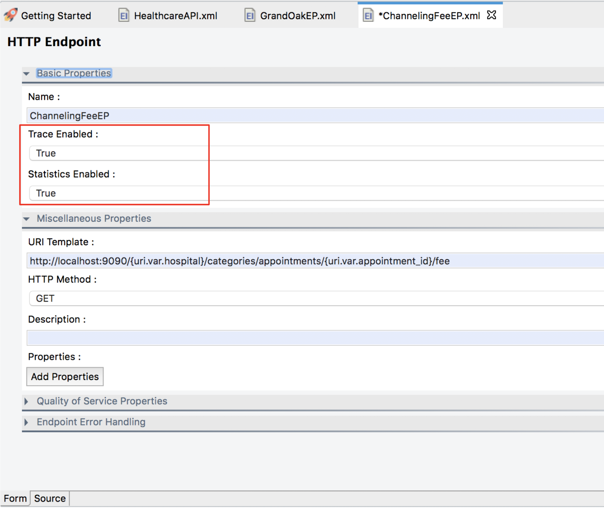
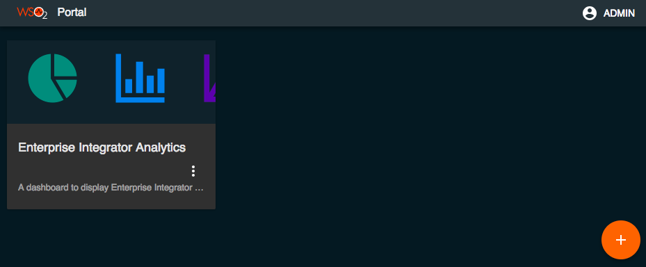
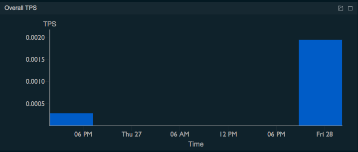
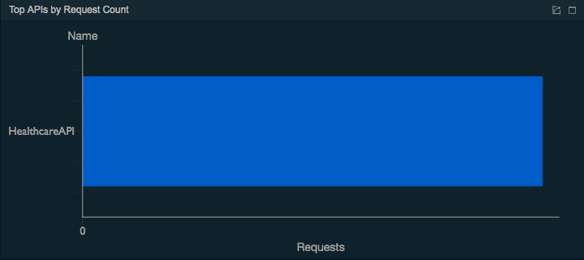
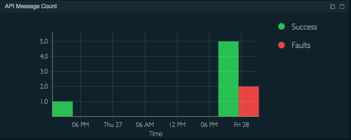
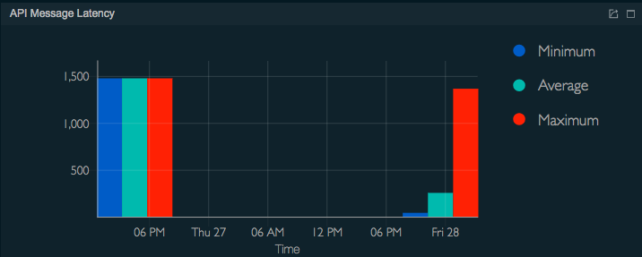
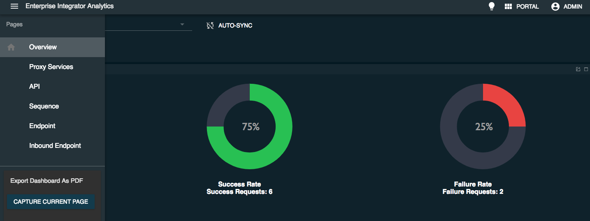

# Monitoring Statistics and Tracing

Monitoring the usage of the integration runtime using statistical information is very important for understanding the overall health of a system that runs in production. 
Statistical data helps to do proper capacity planning, to keep the runtimes in a healthy state, 
and for debugging and troubleshooting problems. 
When it comes to troubleshooting, the ability to trace messages that pass through the mediation flows of the 
Micro Integrator is very useful. 
For monitoring statistics and tracing, we can use the Analytics profile of 
[WSO2 Enterprise Integrator 6.x family](https://docs.wso2.com/display/EI660). 

You can monitor the following statistics through the EI Analytics profile:

- Request Count
- Overall TPS
- Overall Message Count
- Top Proxy Services by Request Count
- Top APIs by Request Count
- Top Endpoints by Request Count
- Top Inbound Endpoints by Request Count
- Top Sequences by Request Count

Please see [this documentation](https://docs.wso2.com/display/EI660/Analyzing+the+ESB+Profile+Statistics+Overview) 
for more information on what you can monitor using EI Analytics.

The Analytics profile consists of two components: **Worker** and **Dashboard**. 
The worker is the server that processes the data streams that are sent from the Micro Integrator and publishes 
the statistics to a database. The dashboard reads the statistics published by the worker and displays the statistics. 
The worker and dashboard are connected through the database.

See the instructions given below on using the Analytics profile with the Micro Integrator.

## Configuring the Micro Integrator

To enable statistics monitoring for the Micro Integrator, add the following parameters in the `deployment.toml` file of your Micro Integrator. This file is stored in the `MI_HOME/conf`.

!!! Tip
    When you run the embedded Micro Integrator of [WSO2 Integration Studio](../../develop/installing-WSO2-Integration-Studio), the `MI_HOME/conf` directory is as follows: `MI_TOOLING_HOME/Contents/Eclipse/runtime/microesb/conf/` (in MacOS/Linux/CentOS) or `MI_TOOLING_HOME/runtime/microesb/conf` (in Windows) directory. 

```toml
[mediation]
flow.statistics.enable=true
stat.tracer.collect_payloads=true
stat.tracer.collect_mediation_properties=true
```

## Enabling statistics for artifacts

You must enable statistics/tracing for the integration artifacts that you wish to monitor.

### Enabling statistics for ALL artifacts

If you want to collect statistics for **all** your integration artifacts, be sure to add the following parameter to the `deployment.toml` file in addition the [parameters explained above](#configuring-the-micro-integrator):

```toml
[mediation]
flow.statistics.capture_all=true
```

Alternatively, you can enable statistics for selected artifacts as explained below.

### Enabling statistics for specific artifacts

Let's use the integration artifacts from the [service chaining](../../use-cases/tutorials/exposing-several-services-as-a-single-service) tutorial.

!!! Warning
    It is not recommended to enable **tracing** in production environments as it generates a large number of events that reduces the performance of the analytics profile. Therefore, tracing should only be enabled in development environments.

If you did not try the [service chaining](../../use-cases/tutorials/exposing-several-services-as-a-single-service) tutorial yet:

1.  Download the [pre-packaged project](https://github.com/wso2-docs/WSO2_EI/blob/master/Integration-Tutorial-Artifacts/ExposingSeveralServicesTutorial.zip) for the **service chaining** use case.
2.  [Open WSO2 Integration Studio](../../develop/installing-WSO2-Integration-Studio) and [import the pre-packaged project](../../develop/importing-projects).

Follow the steps below to enable statistics and tracing for the **REST API** artifact:

1.  Select `HealthcareAPI` in the canvas of WSO2 Integration Studio to open the **Properties** tab.
2.  Select **Statistics Enabled** and (if required) **Trace Enabled** as shown below.
     

Follow the steps below to enable statistics for the **endpoint** artifacts:

1.  Select the required endpoint artifacts from the project explorer. 
2.  Select **Statistics Enabled** and (if required) **Trace Enabled** as shown below.
     

## Starting the Analytics Worker

!!! Note
    Be sure to start the **Analytics** worker before [starting the Micro Integrator](#starting-the-micro-integrator).

1.  Download and install [WSO2 Enterprise Integrator 6.x.x](https://docs.wso2.com/display/EI660/Installing+the+Product). The location of your WSO2 EI 6.x.x installation will be referred to as `<EI_6.x.x_HOME>` from hereon.
2.  Open a terminal and navigate to the `<EI_6.x.x_HOME>/wso2/analytics/bin` directory.
3.  Start the Analytics Worker runtime by executing the following command:

    -   On **MacOS/Linux/CentOS**

        ```bash
        sh worker.sh
        ```

    -   On **Windows**

        ```bash
        worker.bat
        ```

## Starting the Micro Integrator

!!! Warning
    To allow the Micro Integrator server and the Analytics server to communicate using SSL, the digital certifacates should be shared by the two servers. See the instructions on [adding SSL certificates to keystores](../../setup/security/importing_ssl_certificate).
    
    For testing, you can simply copy the keystore files from the `<EI_6.x.x_HOME>/wso2/analytics/resources/security` directory to the `MI_HOME/resources/security` directory.

Once you have [started the Analytics Worker](#starting-the-analytics-worker), you can [start the Micro Integrator](../../develop/deploy-and-run) with your integration artifacts.

## Starting the Analytics Dashboard

1.  Open a terminal and navigate to the `<EI_6.x.x_HOME>/wso2/analytics/bin` directory.
2.  Start the Analytics Dashboard runtime by executing the following command:

    -   On **MacOS/Linux/CentOS**

        ```bash
        sh dashboard.sh
        ```

    -   On **Windows**

        ```bash
        dashboard.bat
        ```

In a new browser window or tab, open the Analytics dashboard using the following URL: <https://localhost:9643/portal> . Use
    `           admin          ` for both the username and password.


Now, you can [invoke the integration artifacts](#invoking-the-artifacts) and view the statistics on this dashboard.

## Invoking the artifacts

**Starting the backend**

Let's start the hospital service that serves as the backend to the [service chaining](../../use-cases/tutorials/exposing-several-services-as-a-single-service) use case: 

1. Download the JAR file of the back-end service from [here](https://github.com/wso2-docs/WSO2_EI/blob/master/Back-End-Service/Hospital-Service-2.0.0-EI7.jar).
2. Open a terminal, navigate to the location where your saved the back-end service.
3. Execute the following command to start the service:

    ```bash
    java -jar Hospital-Service-2.0.0-EI7.jar
    ```

**Sending a message**

Let's send 8 requests to the Micro Integrator to invoke the integration artifacts:

!!! Tip
    For the purpose of demonstrating how successful messages and message failures are illustrated in the dashboard, let's send 2 of the requests while the back-end service is not running. This should generate a success rate of 75%.

1.  Create a JSON file called `request.json` with the following request payload.

    ```java
    {
    "name": "John Doe",
    "dob": "1940-03-19",
    "ssn": "234-23-525",
    "address": "California",
    "phone": "8770586755",
    "email": "johndoe@gmail.com",
    "doctor": "thomas collins",
    "hospital": "grand oak community hospital",
    "cardNo": "7844481124110331",
    "appointment_date": "2025-04-02"
    }
    ```

2.  Open a command line terminal and execute the following command (**six times** ) from the location where you save the
    `request.json` file:  

    ```bash
    curl -v -X POST --data @request.json http://localhost:8290/healthcare/categories/surgery/reserve --header "Content-Type:application/json"
    ```

    If the messages are sent successfully, you will receive the following response for each request.

    ```json
    {"appointmentNo":1,
    "doctorName":"thomas collins",
    "patient":"John Doe",
    "actualFee":7000.0,
    "discount":20,
    "discounted":5600.0,
    "paymentID":"e1a72a33-31f2-46dc-ae7d-a14a486efc00",
    "status":"Settled"}
    ```

3.  Now, shut down the back-end service and send two more requests.

## Analyzing statistics

Go to the [Analytics Dashboard](#starting-the-analytics-dashboard) and see the statistics listed below.

!!! Tip
    See the documentation on [using the Analytics dashsboard](https://docs.wso2.com/display/EI660/Using+the+WSO2+EI+Analytics+Dashboard) for more information on dashboard function.

1.  Click the **Enterprise Integrator Analytics** icon shown below to
    open the dashboard.  
      
      
2.  View the statistics overview for all the integration artifacts that have
    published statistics:  
    

3.  The number of transactions handled by the Micro Integrator per second is mapped
    on a graph as follows.

    

4.  The success rate and the failure rate of the messages received by
    the Micro Integrator during the last hour are mapped in a graph as
    follows.  
    

5.  The `            HealthcareAPI           ` REST API is displayed
    under **TOP APIS BY REQUEST COUNT** as follows.  
    
6.  The three endpoints used for the message mediation are displayed
    under **Top Endpoints by Request Count** as shown below.  
    
7.  In the Top APIS BY Request COUNT gadget, click
    `           HealthcareAPI          ` to open the
    **OVERVIEW/API/HealthcareAPI** page. The following is displayed.
    -   The **API Request Count** gadget shows the total number of
        requests handled by the `             StockQuoteAPI            `
        REST API during the last hour:  
        
    -   The **API** **Message Count** gadget maps the number of
        successful messages as well as failed messages at different
        times within the last hour in a graph as shown below.  
          
    -   The **API** **Message Latency** gadget shows the speed with
        which the messages are processed by mapping the amount of time
        taken per message at different times within the last hour as
        shown below.  
          
    -   The **Messages** gadget lists all the the messages handled by
        the `             StockQuoteAPI            ` REST API during the
        last hour with the following property details as follows.  
        
    -   The **Message Flow** gadget illustrates the order in which the
        messages handled by the `StockQuoteAPI`
        REST API within the last hour passed through all the mediation
        sequences, mediators and endpoints that were included in the
        message flow as shown below.  
         
8. In the **Top Endpoints by Request Count** gadget, click one of the endpoints to view simillar statistics per endpoint.

    -   `ChannelingFeeEP`
    -   `SettlePaymentEP`
    -   `GrandOaksEP`

9. You can also navigate to any of the artifacts by using the top-left
    menu as shown below. For example, to view the statistics of a
    specific endpoint, click **Endpoint** and search for the required
    endpoint.  
    

## Message tracing

When you go to the [Analytics Dashboard](#starting-the-analytics-dashboard) the message details will be logged as follows:

 
