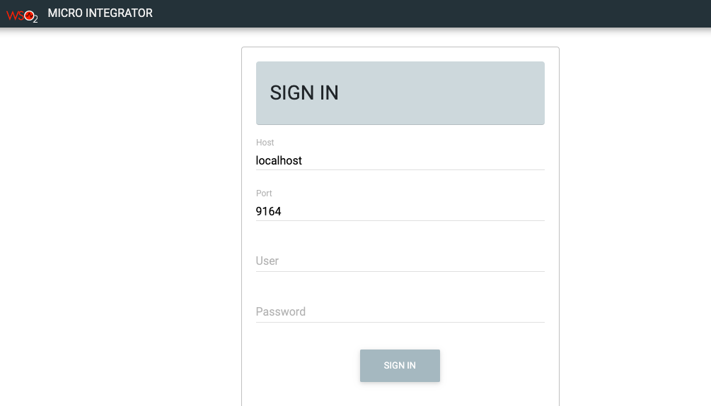

# Micro Integrator Dashboard

The Micro Integrator dashboard provides a graphical view of the synapse artifacts that are deployed in a specified Micro Integrator server instance. This dashboard is an alternative to the [Micro Integrator CLI](../../administer-and-observe/using-the-command-line-interface), which allows you to monitor your deployments from the command line.

The dashboard as well as the CLI communicates with the management API of WSO2 Micro Integrator to function. Therefore, be sure to [enable the Management API](#enable-the-management-api) in the server before using the management dashboard or the CLI.

## Enable the Management API

To use the management dashboard, you need to enable the management API when you
start your WSO2 Micro Integrator instance. This can be done by passing
the following system property when you
start the Micro Integrator:

```bash
-DenableManagementApi
```

Note that the default address is **https://localhost** and the port is **9164**.

-   When you run the Micro Integrator on Docker, start your Docker
    container by passing the `enableManagementApi` system property:

    ```bash
    docker run -p 8290:8290 -p 9164:9164 -e JAVA_OPTS="-DenableManagementApi=true" <Docker_Image_Name>
    ```

-   When you run the Micro Integrator on a VM, use the following command
    to enable the `enableManagementApi` system property:

    ```bash
    sh micro-integrator.sh -DenableManagementApi
    ```

-   The CLI tool is enabled for the embedded Micro Integrator in WSO2 Integration Studio by default.

## Install and run the dashboard

!!! Warning
    In a non-production environment (with the self signed certificate), you have to add the certificate of the micro integrator instance to the browser as a trusted source. For example, direct the browser to `https://localhost:9164/magagement` and add the site as trusted. This step will not be required with a custom production certificate.

1.  To download the dashboard, go to [**WSO2 Micro Integrator** website](https://wso2.com/integration/micro-integrator/#) -> **Download** -> **Other Resources**, and click **Monitoring Dashboard**.
2.  Execute the following command to start the dashboard server:

    ```bash
    sh dashboard.sh
    ```
    The dashboard server will start as follows.

    ```bash
    Web app 'dashboard' is available at 'https://127.0.0.1:9743/dashboard
    ```
  
3.  Log in to the dashboard using the following: 

    ```bash
    https://127.0.0.1:9743/dashboard/login
    ```

3.  Enter your credentials to log in:

    

    After a successful login, you will be redirected to the home page from where you can browse the deployed artifacts in the micro integrator server instance.
     
    

## Configure dashboard security (Optional)

By default, the management api of the Micro Integrator is shipped with a CORS configuration that allows all origins. This configuration can be found in the `internal-apis.xml` file (stored in the `MI-HOME/conf/`) as shown below. 
  
```xml
<cors>
       <enabled>true</enabled>
       <allowedOrigins>https://127.0.0.1:9743</allowedOrigins>
       <allowedHeaders>Authorization</allowedHeaders>
 </cors>

```
If required, you can remove the wild card and add a specific origin for this configuration for security requirements.  

As the management dashboard is utilizing the management api, the user store is bound to the given api. Therefore, if you want to add a new user to view the management dashboard, you have to add a new user to the userstore defined in the `internal-apis.xml` as shown below.

```xml
<UserStore>
    <users>
        <user>
            <username>admin</username>
            <password>admin</password>
        </user>
    </users>
</UserStore>
```