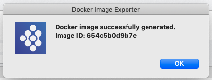
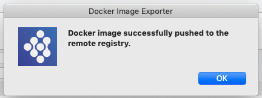

# Creating a Kubernetes Exporter Project

Create a Kubernetes project directory if you want to deploy your integration solutions in a Kubernetes environment. 

The Kubernetes project allows you to package multiple [integration projects](../../develop/creating-projects) into a single Docker image. Also, a file named **integration_cr.yaml** is generated, which can be used to carry out Kubernetes deployments based on the [k8s-ei-operator](../../setup/deployment/kubernetes_deployment/#ei-kubernetes-k8s-operator).

!!! Tip
    If you want to simultaneously create all the projects required for your use case, read about the [integration project solution](../../develop/creating-project-solution).

## Prerequisites
    
It is recommended to [get the latest updates](../../develop/installing-WSO2-Integration-Studio#get-the-latest-updates) for your [WSO2 Integration Studio](../../develop/installing-WSO2-Integration-Studio) before trying these instructions.

## Creating the Kubernetes project

Follow the steps given below.   

1.  Open **WSO2 Integration Studio** and click **Miscellaneous → Create New Kubernetes Project** in the **Getting Started** view as shown below.
    
    

2.  In the **New Kubernetes Project** dialog that opens, enter a name for the Kubernetes project and other parameters as shown below.

    

    Enter the following information:

    <table>
        <tr>
            <th>
                Parameter
            </th>
            <th>
                Description
            </th>
        </tr>
        <tr>
            <td>
                Kubernetes Project Name
            </td>
            <td>
                <b>Required</b>. Give a name for the Kubernetes project.
            </td>
        </tr>
        <tr>
            <td>
                Integration Name
            </td>
            <td>
                <b>Required</b>. This name will be used to identify the integration solution in the kubernetes custom resource. The custom resource file (<b>integration_cr.yaml</b>) for this solution will be generated along with the other artifacts.
            </td>
        </tr>
        <tr>
            <td>
                Number of Replicas
            </td>
            <td>
                <b>Required</b>. Specify the number of pods that should be created in the kubernetes cluster.
            </td>
        </tr>
        <tr>
            <td>
                Base Image Repository
            </td>
            <td>
                <b>Required</b>. Select the base Micro Integrator Docker image for your solution. Use one of the following options:
                <ul>
                    <li>
                        <b>wso2/micro-integrator</b>: This is the community version of the Micro Integrator Docker image, which is stored in the <a href="https://hub.docker.com/r/wso2/micro-integrator">public WSO2 Docker registry</a>. This is selected by default.
                    </li>
                    <li>
                        <b>docker.wso2.com/wso2mi</b>: This is the Micro Integrator Docker image that includes <b>product updates</b>. This image is stored in the <a href="https://docker.wso2.com/tags.php?repo=wso2mi">private WSO2 Docker registry</a>.
                        Note that you need a valid <a href="https://wso2.com/subscription/free-trial">WSO2 subscription</a> to use the Docker image with updates.
                    </li>
                    <li>
                        You can also use a custom Docker image from a custom repository.
                    </li>
                </ul>
                If you specify a Docker image from a private repository, note that you need to log in to your repository from a terminal before you build and push the image (as explained below).
            </td>
        </tr>
            <td>
                Base Image Tag
            </td>
            <td>
                <b>Required</b>. Specify the tag of the base image that you are using.
            </td>
        <tr>
        <tr>
            <td>
                Target Image Repository
            </td>
            <td>
                <b>Required</b>. The Docker repository to which you will later push this Docker image. 
                <ul>
                    <li>
                        If your repository is in <b>Docker Hub</b>, use the <b>docker_user_name/repository_name</b> format.
                    </li>
                    <li>
                        If you are using any other repository, use the <b>repository_url/repository_user_name/repository_name</b> forrmat.
                    </li>
                </ul> 
                If required, you can update this information later when you build and push the Docker image to the relevant repository.
            </td>
        </tr>
        <tr>
            <td>
                Target Image Tag
            </td>
            <td>
                <b>Required</b>. Give a tag name for the Docker image.
            </td>
        </tr>
        <tr>
            <td>
                Automatically deploy configurations
            </td>
            <td>
                This check box indicates that you are using WSO2 EI 7 Micro Integrator as the base image. It is recommended to leave this check box selected when you use WSO2 EI 7.
            </td>
        </tr>
        <tr>
            <td>
                Environment Variables
            </td>
            <td>
                You can enter multiple environment variables as key-value pairs.
            </td>
        </tr>
    </table>

3.  Optionally, click **Next** and configure Maven details for the Kubernetes project.

    
    
4.  Click **Finish**. The Kubernetes project is created in the project explorer. 

## The Kubernetes project directory

Expand the **Kubernetes Exporter Project** in the project explorer. See that the following folders and files are created:


<table>
    <tr>
        <th>
            Directory
        </th>
        <th>
            Description
        </th>
    </tr>
    <tr>
        <td>
            Libs
        </td>
        <td>
            Directory to store libraries. During the build time, the libraries inside this folder will be copied to the image.
        </td>
    </tr>
    <tr>
        <td>
            Resources
        </td>
        <td>
            This folder stores additional files and resources that should be copied to the Docker image. During the build time, the resources inside this directory will be copied to the image.
        </td>
    </tr>
    <tr>
        <td>
            deployment.toml
        </td>
        <td>
            The <a href="../../references/config-catalog">product configuration file</a>.
        </td>
    </tr>
    <tr>
        <td>
            Dockerfile
        </td>
        <td>
            The Dockerfile containing the build details.
        </td>
    </tr>
    <tr>
        <td>
            integration_cr.yaml
        </td>
        <td>
            Kubernetes configuration file generated based on the user inputs.
        </td>
    </tr>
    <tr>
        <td>
            pom.xml
        </td>
        <td>
            The file for selecting the relevant composite applications that should be included in the Docker image. This information is also used when you later build and push Docker images to the Docker registries.
        </td>
    </tr>
</table>
       
## Build and Push Docker images

!!! Info
    **Before you begin**:

    -   Create your integration artifacts in a [Config project](../../develop/creating-projects/#esb-config-proje) and package the artifacts in a [Composite Application project](../../develop/packaging-artifacts). For example, see the HelloWorld sample given below.

        

    -   If you are using a Micro Integrator Docker image from a private registry as your base image:

        1.  Open a terminal and use the following command to log in to Docker:
            ```bash 
            docker login -u username -p password 
            ```
        2.  In the next step, specify the name of the private Docker registry.


Follow the steps given below.

1.  Open the **pom.xml** file inside the Kubernetes project and click **Refresh** on the top-right. Your composite application project with integration artifacts will be listed under **Dependencies** as follows:

    
    
2.  Select the composite applications that should be packed inside the Docker image (under **Dependencies**).
3.  If required, you can update the **Target Repository** to which the image should be pushed and the **Target Tag**.
4.  Save the file and click **Build & Push** on the top-right to start the Docker image build-and-push process. The **Enter Docker Registry Credentials** wizard opens.

    
    
4.  Enter the following details in the wizard:

    <table>
        <tr>
            <th>
                Parameter
            </th>
            <th>
                Description
            </th>
        </tr>
        <tr>
            <td>
                Registry URL Type
            </td>
            <td>
                The Docker image registry to which the image will be pushed: <b>Docker Hub</b> or <b>Other</b>.
            </td>
        </tr>
        <tr>
            <td>
                Username
            </td>
            <td>
                Username of the target registry repository.
            </td>
        </tr>
        <tr>
            <td>
                Password
            </td>
            <td>
                Password of the target registry repository.
            </td>
        </tr>
    </table>
    
5.  Once you enter the above details, click **Push Image**.
6.  First, it will build the Docker image based on the Dockerfile and the Target details. When the image is created, you will see the following message.

    

7.  Finally, it will start to push the image to the given registry. Once the process is completed, you will see the following message.

    
