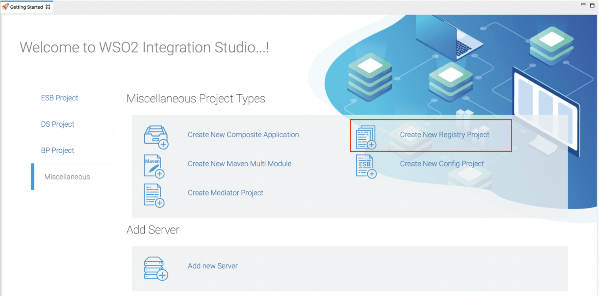
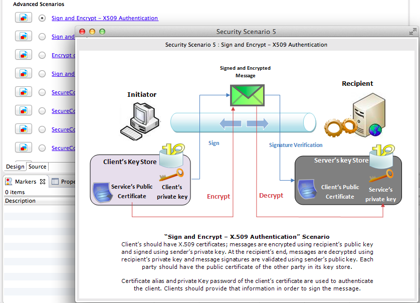
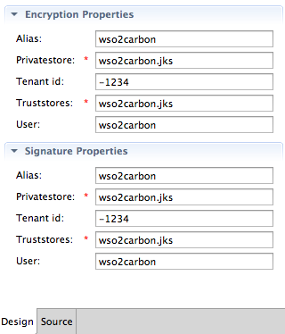
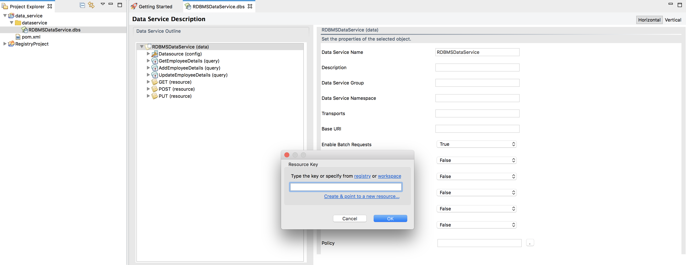
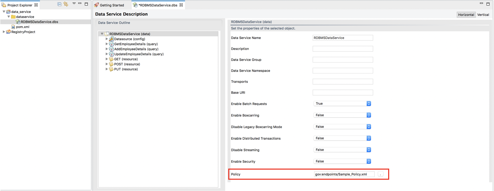

# Securing a data service
## Applying WS-Security policies

WSO2 supports WS-Security, WS-Policy, and WS-Security Policy
specifications. These specifications define a behavioral model for Web
services. To enable a security policy for a data service, you need to
first create a security policy file, and then add it to the data
service.

### Step 1: Creating a registry resource project

Registry artifacts (such as security policy files) should be stored in a
**Registry Resource** project. Follow the steps given below to create a
project:

1.  Open **WSO2 Integration Studio** and click **Miscelleneous → Create
    New Registry **Project**** in the **Getting Started** tab as shown
    below.

    

2.  Enter a name for the project and click **Next** .
3.  Enter the Maven information about the project and click **Finish** .
4.  The new project will be listed in the project explorer.

### Step 2: Creating a security policy as a registry resource

1.  Right-click the registry resource project in the left navigation
    panel, click **New** , and then click **Registry Resource** . This
    will open the **New Registry Resource** window.
2.  Select the **From existing template** option as shown below and
    click **Next** .  
    
3.  Enter the following details:

    | Parameter     | Value          |
    |---------------|----------------|
    | Resource Name | Sample_Policy |
    | Artifact Name | Sample_Policy |
    | Template      | WS-Policy      |
    | Registry      | gov            |
    | Registry path | ws-policy/     |

4.  Click **Finish** and the policy file will be listed in the
    navigator.
    1.  Let's use the **Design View** to enable the required security
        scenario. For example, enable the **Sign and Encyrpt** security
        scenario as shown below.

        !!! Tip
            Click the icon next to the scenario to get details of the scenario.
          
        

    2.  You can also provide encryption properties, signature
        properties, and advanced rampart configurations as shown below.

        -   **Encryption/Signature Properties**

            

        -   **Rampart Properties**

            

        !!! Info
            **Using role-based permissions?**
        
            For certain scenarios, you can specify user roles. After you select the scenario, scroll to the right to see the **User Roles** button.  

            
        
            Either define the user roles inline or retrieve the user roles from the server.
        
            -  **Define Inline**

                

            -  **Get from the server**
        
                
                
        !!! Info
            Switch to source view of the policy file and make sure the tokenStoreClass in the policy file is 'org.wso2.micro.integrator.security.extensions.SecurityTokenStore'
        
5.  Save the policy file.

### Step 3: Adding the security policy to the data service

Once you have configured the policy file, you can add the security
policy to the data service as explained below.

1.  If you have already created a data service using WSO2 Integration
    Studio, select the file from the Project Explorer. Alternatively,
    you can download this [sample data service
    file](attachments/119130577/119130595.dbs) and import it to your
    development environment.

    !!! Tip
        Be sure to update your database credentials in the dataservice file.
    
2.  Once you have select the data service file, click the **browse**
    icon for the **Policy** field.

    

3.  Click **workspace**, to add the security policy from the current
    workspace. You can select the path to the
    `          sample_policy.         ` xml file that you created in the
    previous steps.  
    
4.  Click **OK**, and the security policy will be added to the data
    service.  
    
5.  Save the data service.

## Using an encrypted datasource password

When you create a data service for an RDBMS datasource, you have the
option of encrypting the datasource connection password. This ensures
that the password is encrypted in the configuration file (.dbs file) of
the data service.

### Step 1: Encrypting the datasource password

Any plain text password can be encrypted using the Cipher Tool that is
shipped with your WSO2 product. This tool uses the secure vault
implementation in the product to perform the encryption.

1.  Start by initiating the Cipher Tool. Execute the following command
    from the `MI_HOME/bin         ` directory.  
    -   Linux: `sh ciphertool.sh -Dconfigure`
    -   Windows: `ciphertool.bat -Dconfigure`
2.  To encrypt your password, execute the same command without
    -Dconfigure as shown below.  
    -   Linux: `sh ciphertool.sh`
    -   Windows: `ciphertool.bat`

    This command will prompt you to enter the KeyStore Password of the running Carbon instance. The default is
    `wso2carbon         ` .
3.  Specify the plain text password that is used to log in to your
    database and execute the command. The encrypted password will be
    returned.

    !!! Tip
        Be sure to use the password to the RDBMS that is used in your data
        service.
    
4.  Add the encrypted password and an alias to the
    `           cipher-text.properties          ` file (stored in the
    `MI_HOME/repository/conf/security/          `
    directory) as shown below. Note that you can use a name of your
    preference for the password alias. In this example, we have used
    `DB_Password_Alias` .

    ```java
    DB_Password_Alias=<encrypted_value>
    ```

5.  Save the file.

### Step 2: Using the encrypted password in the data service

Once you have encrypted the datasource password, you can update the data
service as explained below.

1.  Select the data service from the project explorer, right click and
    go to **Open With -\> Text Editor** . This will open the data
    service in text form.

    !!! Tip
        If you don't have an already created data service in WSO2 Integration Studio, you can [create a new data service](#ManagingDataIntegrationArtifactsviaTooling-Creatingadataservice) or [import an existing data service](#ManagingDataIntegrationArtifactsviaTooling-Importingadataservice) file.
    
2.  Update the datasource configuration by adding the secret alias of
    the password. See the example given below.

    ```xml
    <config id="Datasource">
            <property name="org.wso2.ws.dataservice.user">root</property>
            <property name="org.wso2.ws.dataservice.password" svns:secretAlias="DB_Password_Alias"></property>
            <property name="org.wso2.ws.dataservice.protocol">jdbc:mysql://localhost:3306/Employees</property>
            <property name="org.wso2.ws.dataservice.driver">com.mysql.jdbc.Driver</property>
            <property name="org.wso2.ws.dataservice.minpoolsize"/>
            <property name="org.wso2.ws.dataservice.maxpoolsize"/>
            <property name="org.wso2.ws.dataservice.validation_query"/>
    </config>
    ```

3.  Add the "http://org.wso2.securevault/configuration" namespace
    configuration to the datasource as follows:

    ```xml
    <data enableBatchRequests="true" name="RDBMSDataService" serviceNamespace="http://ws.wso2.org/dataservice/samples/rdbms_sample" xmlns:svns="http://org.wso2.securevault/configuration">
    ```

4.  Save the data service file.

### Step 5: Testing the data service

You can test the data service artifacts by following the steps given
below.

1.  Package the data service file (.dbs file) into a **Composite
    Application (CApp)**. See the instructions in [Packaging Artifacts
    into Composite
    Applications](https://docs.wso2.com/display/ADMIN44x/Packaging+Artifacts+into+Composite+Applications)
    .
2.  Add your WSO2 EI product instance to WSO2 Integration Studio and
    deploy the CApp in the server. See the instructions in [Deploying
    Composite Applications in the
    Server](https://docs.wso2.com/display/ADMIN44x/Deploying+Composite+Applications+in+the+Server)
    .
3.  Start the Micro Integrator. The data service is now deployed in Micro Integrator.
