# Creating Unit Test Suite

Once you have developed an integration solution, WSO2 Integration Studio allows you to build unit tests for the following:

- Test [mediation sequences](../../develop/creating-artifacts/creating-reusable-sequences), [proxy services](../../develop/creating-artifacts/creating-a-proxy-service), and [REST apis](../../develop/creating-artifacts/creating-an-api) with multiple test cases
- Test the artifacts with [registry resources](../../develop/creating-artifacts/creating-registry-resources).
- Test the artifacts with [Connectors](../../develop/creating-artifacts/adding-connectors).

## Create Unit Test Suite

1.  Open WSO2 Integration Studio.
2.  Open an existing project with your integration solution.
3.  Right-click the **test** folder, which is parallel to the **src** folder and go to **New** -> **Unit Test Suite** as shown below.

    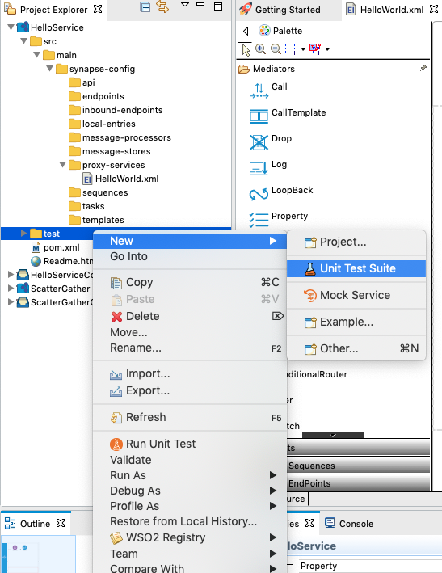

    The **New Unit Test Suite** wizard opens.
    
4.  Select **Create a New Unit Test Suite** and click **Next**.

    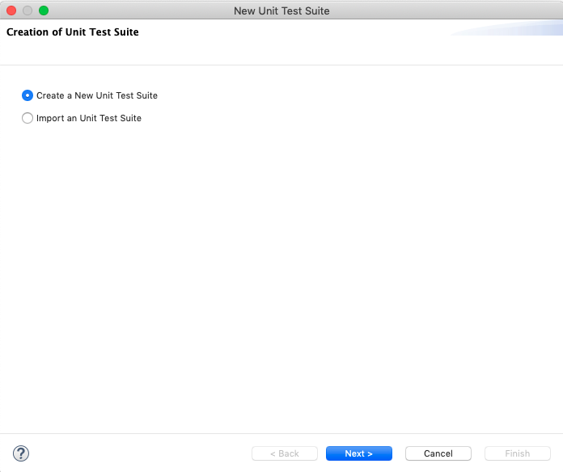
    
5.  Specify a name for the unit test suite. Then, select the artifact file that you want to test from the file list and click **Next**. 

    !!! Note 
        You can only select one sequence, proxy service, or API artifact per unit test suite.

    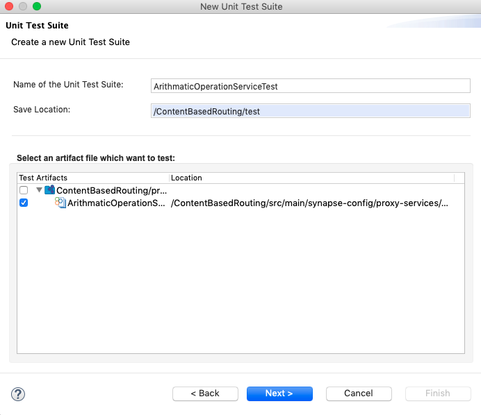
    
6.  Select the supporting artifacts from the list as shown below and click **Next**.

    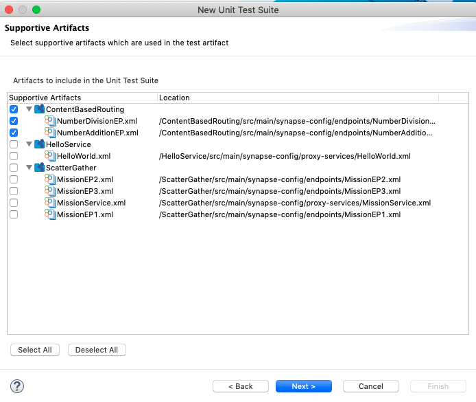
    
7.  You can use a mock service to simulate the actual endpoint. If you have an already created Mock Service, select the mock service files from the list as shown below. You can also [create a new Mock Service](#create-mock-service) for this purpose.

    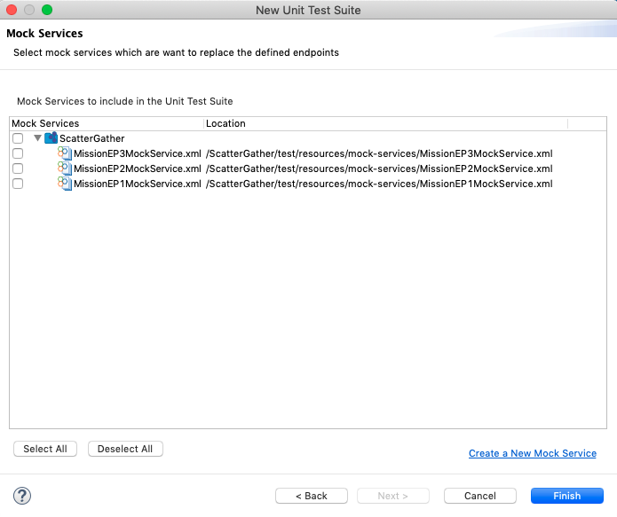

8. Click **Finish**.

## Update the Unit Test Suite

Once you have created a Unit Test Suite in WSO2 Integration Studio, you can find it inside the <b>test</b> folder. You can update the Unit Test Suite by adding test cases and changing the supporting artifacts and mock-services. 

1.  Open Unit Test Suite from the project explorer. You can use either the design view or the source view to update the unit test suite.

    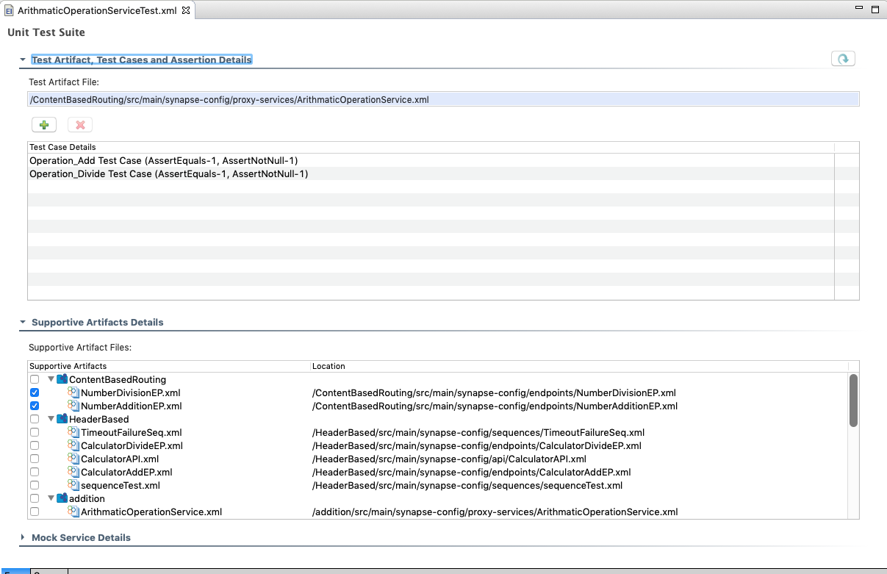
    
2.  In design view, click the '<b>+</b>' button under the **Test Artifact, Test Cases and Assertion Details** section to add a new **test case** to the unit test suite. 

    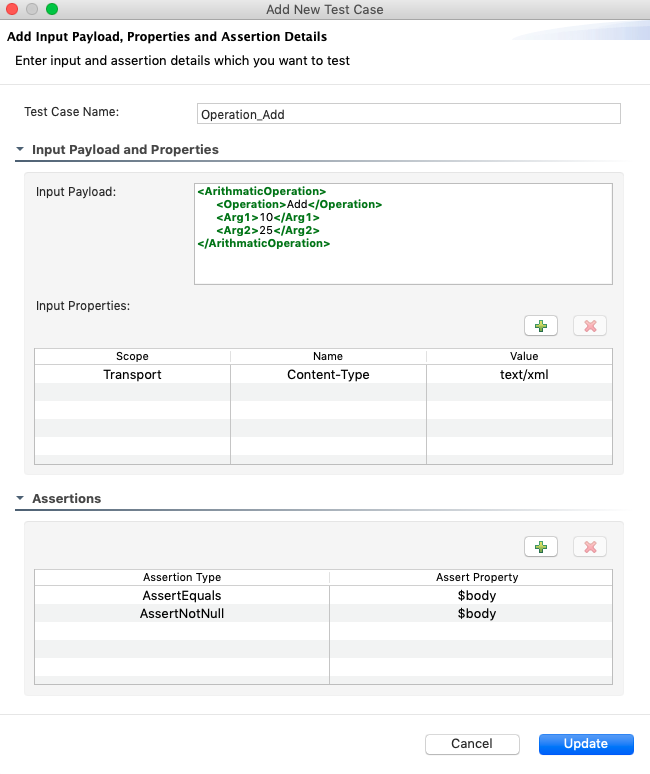
    
3.  Enter the following information:
    
    1.  Enter a name for the test case.
    2.  Update the **Input Payload and Properties** section:

        -  **Input Payload**: The input payload of the test case. This can be **JSON**, **XML**, or **plain text**.
        -  **Input properties**: The input properties of the test case. There are three types of properties allowed in unit testing: **Synapse($ctx), Axis2($axis2)**, and **Transport($trp)** properties. 
        
        For sequences, the test suite allows to add all type of properties with the value. For APIs and proxy services, you are only allowed to add transport properties. 
        
        !!! Note
            For APIs, you also need to specify the **Request Path** and **Request Method** in the this section. The **Request Path** indicates the URL mapping of the API resource. If the URL mapping consists some parameter(s), replace those with values. Also the **Request Method** indicates the REST method of the resource.   
    
    3.  In the **Assertions** section, you can add multiple assertion belonging to two types: **AssertEquals** check the whether the mediated result and expected values are equeal. **AssertNotNull** checks whether the mediated result is not null.
    
        
    
        -   **Assertion Type**: Type of the assertion.
        -   **Actual Expression**: Expression that you want to assert.
            -   **$body**: assert the payload<br/>
            -   **$ctx:<property_name>**: assert synapse property
            -   **$axis2:<property_name>**: assert axis2 property
            -   **$trp:<property_name>**: assert transport property
            -   **$statusCode**: assert status code of the service
            -   **$httpVersion**: assert http version of the service
                
        -   **Expected Value**: Expected value for the actual expression. Type can be a **JSON**, **XML** or a **plain text**.  
        -   **Error Message**: Error message to print when the assertion is failed.
    4.  Once you have added at least one assertion, click **Add**. 
4.  Save the unit test suite.
    
## Run Unit Test Suites

Run the Unit Test Suite(s) in the unit testing server of the embedded Micro Integrator or a remote unit testing server. 

1.  Right-click the **test** directory and click **Run Unit Test** to run all the unit test suites at once. Alternatively, right-click the particular unit test suite and click **Run Unit Test** to run a selected unit test suite.

    

    The **Unit Test Run Configuration** wizard opens. 

2.  Select the specific unit testing server (embedded server or remote server) to run the tests.

    

    **Local Server Configuration**

    If you select this option, you are running the tests in the unit test server of the embedded Micro Integrator. Specify the following details:

    -   **Executable Path**: Path to the unit testing server.
    -   **Server Test Port**: Port of the unit testing server.
    
    **Remote Server Configuration*

    !!! Note 
        **Before you begin**
        Be sure that your remote Micro Integrator is started along with its Unit Testing server. Note that you need to pass the `-DsynapseTest` property with your product startup script as shown below. This property is required for starting the Unit Testing server.

        ```bash tab='On MacOS/Linux/CentOS'
        sh micro-integrator.sh -DsynapseTest
        ```

        ```bash tab='On Windows'
        micro-integrator.bat -DsynapseTest 
        ```
        
        To change starting port of the unit testing server, you can use `-DsynapseTestPort=<PORT>` system property with above command. The default port is 9008. 
    
    If you select this option, you are running the tests in the unit testing server of a remote Micro Integrator. Specify the following details:

    -   **Server Remote Host**: Host IP of the remote unit testing server. This is the host on which the remote Micro Integrator is running.
    -   **Server Test Port**: Port of the remote unit testing server. The default port is 9008. 
            
3. Click **Run** to start the unit test. It will start the unit testing server in the console and prints the summary report for the given unit test suite(s) using the response from the unit testing server. 

    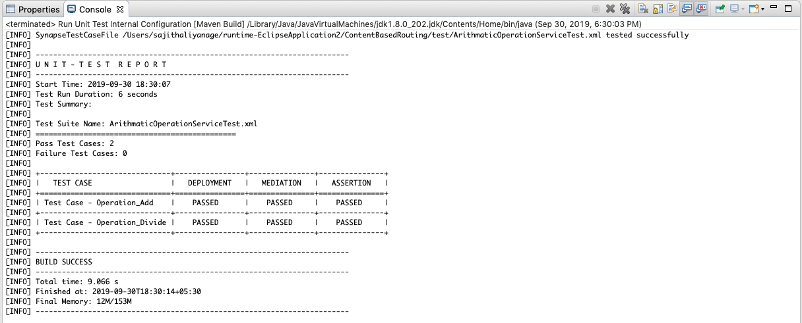    

## Create Mock Service

Mock services give the opportunity to simulate the actual endpoint.

1.  Open an existing project that has your integration solution.
2.  Right-click the **test** folder parallel to the **src** folder, and go to **New** -> **Mock Service** as shown below. 

    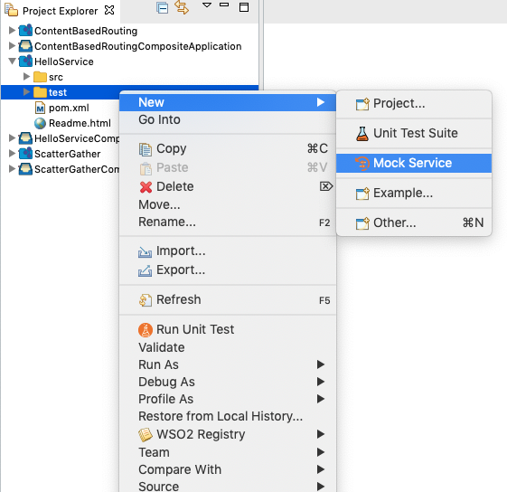 
    
3.  Select **Create a New Mock Service** and click **Next**.

    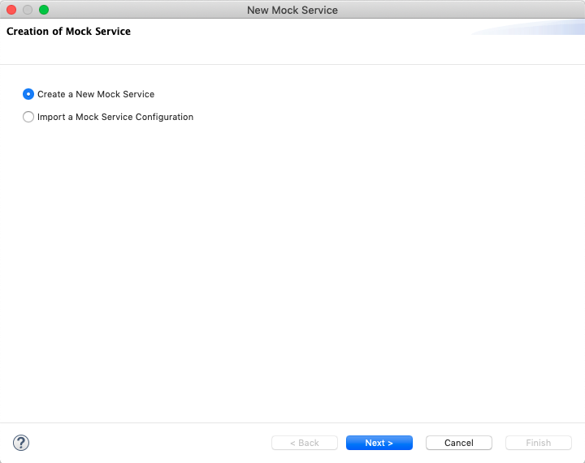 
    
4.  In the **Create a new Mock Service** page, enter the following details:
    
    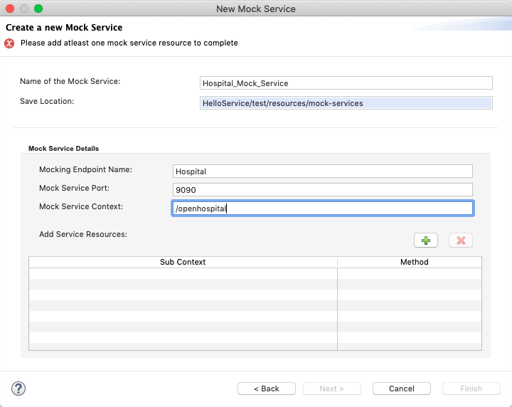 
    
    -   **Name of the Mock Service**: A name for the mock service.
    -   **Mocking Endpoint Name**: Endpoint name which wants to mock.
    -   **Mock Service Port**: Port for the mock service.
    -   **Mock Service Context**: Main context for the service starts with '/'.

5.  Add multiple resources for the mock service as needed. To add multiple resources click the '<b>+</b>' icon on top of the resources table.   

    -   **Service Sub Context**: Sub context of the resource starts with '/'.
    -   **Service Method**: REST method type of the resource.
    
6.  Fill the **Expected Request to the Mock Service Resource** section if you want to mock an endpoint based on the coming request headers or payload.
    
    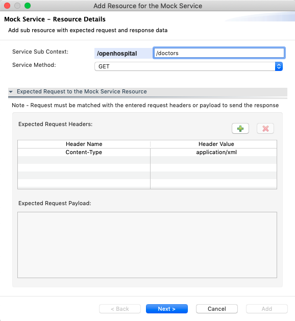 
    
    -   **Header Name**: Expected request header name.
    -   **Header Value**: Expected request header value.
    -   **Expected Request Payload**: Expected request payload to the service.
    
    **Note**: Entered request headers/payload must me matched with the request to send the response a this mock service.
    
7.  Fill the **Response Send Out from the Mock Service Resource** section to get a response from the service.

     
    
    -   **Response Status Code**: Response status code of the mock service.
    -   **Header Name**: Response request header name.
    -   **Header Value**: Response request header value.
    -   **Send Out Response Payload**: Expected response payload from the service.   
  
Once you have entered the required details, click **Add**. It will list the resource under the **Add Service Resource** table with **Sub Context** and **Method**. After that click **Finish** to create a Mock Service. It will locate under the **test → resources → mock-services** directory.

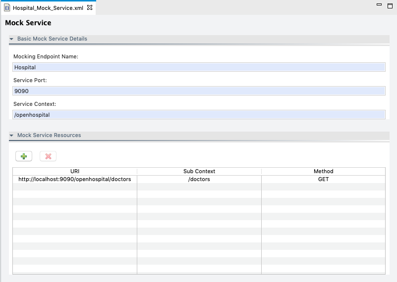     
