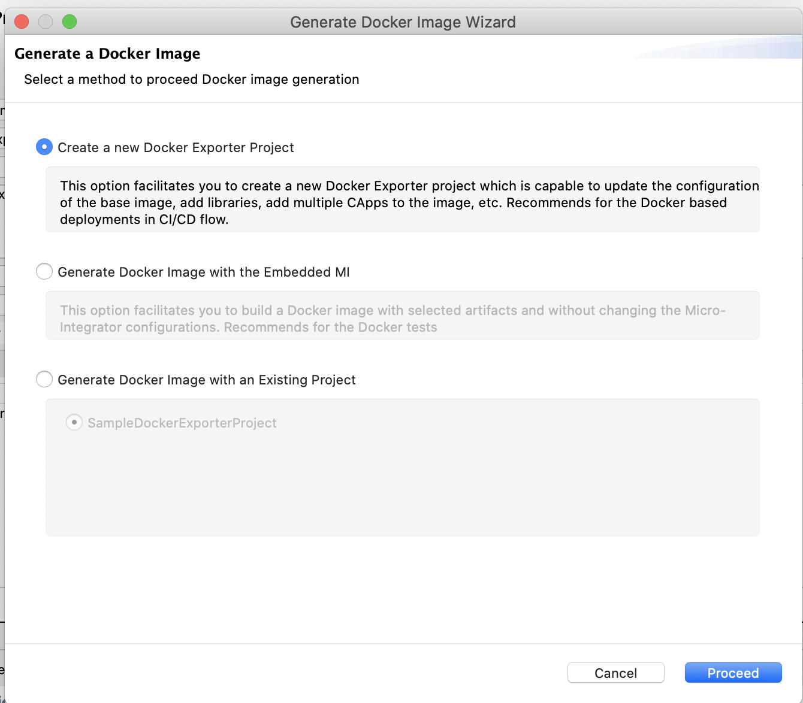
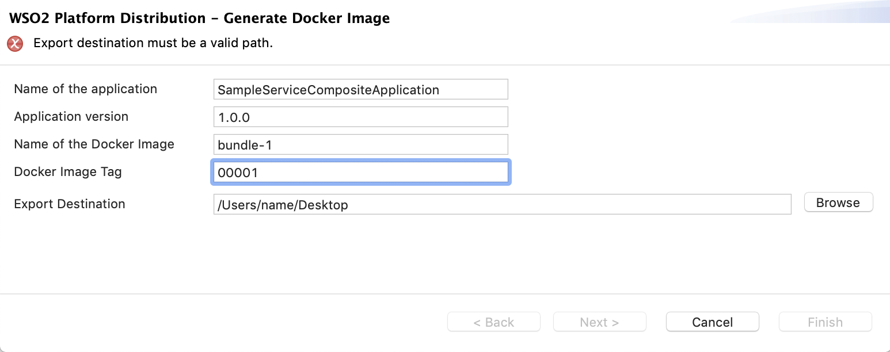
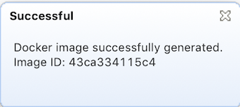

# Generating Docker images

See the topics given below.

## Before you begin

1.  Install Docker from the [Docker Site](https://docs.docker.com/).
2.  Create a Docker Account at [Docker Hub](https://hub.docker.com) and log in.
3.  Start the Docker server.

## Generate the Docker image

1.  Right-click the **Composite Application Project** in the project explorer and
    then click **Generate Docker Image**.  

    
    
2.  In the **Generate Docker Image Wizard** that opens, select one from the following three options and proceed. 
    
    
    
    -  **Create a new Docker Exporter Project**

        Select this option to create a new **Docker Exporter Project** and click **Proceed**. You can build a docker image using this Docker Exporter Project. You are now directed to the [Docker Exporter Project wizard](create-docker-project.md).
    
    -  **Generate Docker Image with the Embedded MI**

        1.  Select this option to generate a Docker image with the embedded Micro Integrator runtime of WSO2 Integration studio. 

            !!! Note
                This is recommended only for testing.

        2.  Click **Next** and enter the following details:
            
             

            <table>
                <tr>
                    <th>
                        Parameter
                    </th>
                    <th>
                        Description
                    </th>
                </tr>
                <tr>
                    <td>
                        Name of the Application
                    </td>
                    <td>
                        The name of the composite
                        application with the artifacts created for your ESB project.
                        The name of the ESB project is displayed by default, but it
                        can be changed if required.
                    </td>
                </tr>
                <tr>
                    <td>
                        Application Version
                    </td>
                    <td>
                        The version of the composite
                        application.
                    </td>
                </tr>
                <tr>
                    <td>
                        Name of the Docker Image
                    </td>
                    <td>
                        Give a name for the Docker image.
                    </td>
                </tr>
                <tr>
                    <td>
                        Docker Image Tag
                    </td>
                    <td>
                        A tag for the Docker image to be used
                        for reference. This is optional.
                    </td>
                </tr>
                <tr>
                    <td>
                        Export Destination
                    </td>
                    <td>
                        Browse for the preferred location
                        in your machine to export the Docker image.
                    </td>
                </tr>
            </table>

        3.  Click **Next**. Select the **Config** projects that you want to include in the Docker image and click **Finish**.  

              
        
            Once the Docker image is successfully created, a message similar to the following appears in your screen.  

            

    -   **Generate Docker Image with an Existing Project**

        This will use the selected Existing Docker Exporter Project and create a docker image.
          