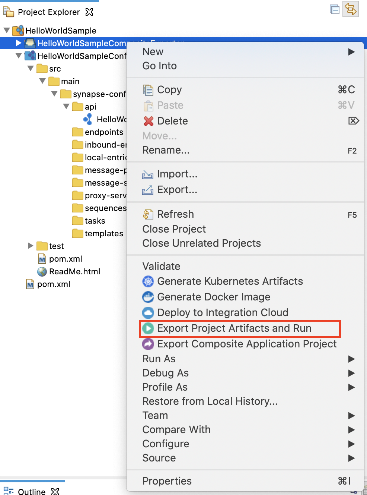

# Injecting Environment Variables to the Embedded Micro Integrator

You can dynamically inject environment variables to the embedded Micro Integrator of WSO2 Integration Studio.

## Step 1: Updating configurations

WSO2 Micro Integrator supports environment variables for server configurations as well as synapse configurations (integration artifacts).

To be able to dynamically inject parameters to the embedded Micro Integrator, you must first define the relevant configurations as environment variables. See the following topics for instructions:

- [Environment variables for server Configurations](../../setup/dynamic_server_configurations)

    !!! Note
        The server configuration file (`deployment.toml`) of the embedded Micro Integrator of WSO2 Integration Studio is stored in the following directories:
        
        - On **MacOS**: `<MI_TOOLING_HOME>/Contents/Eclipse/runtime/microesb/lib/`
        - On **Windows**: `<MI_TOOLING_HOME>/runtime/microesb/lib`

- [Environment variables for synapse configurations](../../develop/injecting-parameters)

## Step 2: Injecting environment variables

To inject environment variables to the embedded Micro Integrator:

1.  Open WSO2 Integration Studio and create your integration artifacts.
2.  [Deploy and run](../deploy-and-run) the artifacts in the embedded Micro Integrator: Right-click the composite application project that contains your artifacts and click **Export
    Project Artifacts and Run** .  
    

    !!! Tip
        Note that you need to run the embedded Micro Integrator at least once before proceeding to specify environment variables.

4.  You can now go to **Run** -> **Run Configurations** on the top menu bar of your computer:

    

5.  In the **Run Configurations** dialog box that opens, select **Micro Integrator Server 1.2.0** that is listed under **Generic Server** in the navigator:

    

6.  In the **Server** tab, select Micro Integrator 1.2.0 from the list if it is not already selected.
7.  Go to the **Environment** tab and click **New** to add an environment variable:

    

8.  Enter the variable name and value as a key-value pair and click **OK**. In this example, let's use the server offset:

    !!! Tip
        The offset parameter in the `deployment.toml` file of the embedded Micro Integrator should be specified as follows:
        ```toml
        [server]
        offset="$env{offset}"
        ```

    


9.  Click **Apply** to apply the new environment variable.

    
