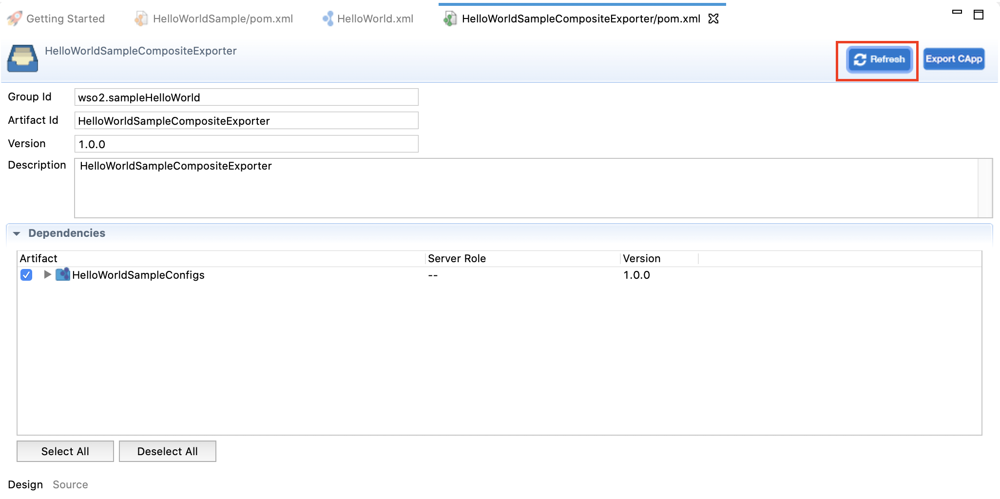

# Troubleshooting WSO2 Integration Studio

The following are some of the ways to troubleshoot errors that you may encounter when working with WSO2 Integration Studio.

## Adding an artifact

Once you add an artifact, you need to refresh the `CompositeApplication.pom`
file to reflect new changes on the Composite Application.



## Restoring the project perspective

If your project view goes missing, you can get it back by navigating
to **Window -> Perspective -> Reset Perspective** from the toolbar.

## Opening a project view

If you need to open a particular project view, you can get it by
navigating to **Window -> Show View -> Other...** from the
toolbar, and open the preferred view from the list.

## Unable to drag and drop mediators into the canvas

When you use **display scaling** that exceed 150% (in **Windows** or **Linux** environments only), you may observe that you cannot drag and drop mediators into the canvas. To overcome this issue, add the following line (VM argument) to the `IntegrationStudio.ini` file in the installation directory of WSO2 Integration Studio.

!!! Warning
    Be sure to add this as the last line in the file.

```bash
-Dswt.autoScale=100
```

## Error creating Docker image (on MacOS)

When you run WSO2 Integration Studio on MacOS, you will sometimes get the following error when you [generate a Docker image](../../develop/generate-docker-image) of your integration artifacts: "**Error creating Docker image**".

The details of the error are given below. To access WSO2 Integration Studio errors, see the instructions on [viewing the WSO2 Integration Studio error log](#view-wso2-integration-studio-error-log)

```java
org.wso2.developerstudio.eclipse.esb.docker.exceptions.DockerImageGenerationException: Could not create the Docker image bundle file.
at org.wso2.developerstudio.eclipse.esb.docker.util.DockerImageGenerator.buildImage(DockerImageGenerator.java:273)
at org.wso2.developerstudio.eclipse.esb.docker.util.DockerImageGenerator.generateDockerImage(DockerImageGenerator.java:202)
at org.wso2.developerstudio.eclipse.esb.docker.job.GenerateDockerImageJob.run(GenerateDockerImageJob.java:141)
at org.eclipse.core.internal.jobs.Worker.run(Worker.java:56)
Caused by: com.spotify.docker.client.exceptions.DockerException: java.io.IOException: Cannot run program “docker-credential-osxkeychain”: error=2, No such file or directory
at com.spotify.docker.client.auth.ConfigFileRegistryAuthSupplier.authForBuild(ConfigFileRegistryAuthSupplier.java:108)
at com.spotify.docker.client.DefaultDockerClient.build(DefaultDockerClient.java:1483)
at com.spotify.docker.client.DefaultDockerClient.build(DefaultDockerClient.java:1460)
at org.wso2.developerstudio.eclipse.esb.docker.util.DockerImageGenerator.buildImage(DockerImageGenerator.java:249)
… 3 more
Caused by: java.io.IOException: Cannot run program “docker-credential-osxkeychain”: error=2, No such file or directory
at java.lang.ProcessBuilder.start(ProcessBuilder.java:1048)
at java.lang.Runtime.exec(Runtime.java:620)
at java.lang.Runtime.exec(Runtime.java:450)
at java.lang.Runtime.exec(Runtime.java:347)
at com.spotify.docker.client.SystemCredentialHelperDelegate.exec(SystemCredentialHelperDelegate.java:140)
at com.spotify.docker.client.SystemCredentialHelperDelegate.get(SystemCredentialHelperDelegate.java:88)
at com.spotify.docker.client.DockerCredentialHelper.get(DockerCredentialHelper.java:119)
at com.spotify.docker.client.DockerConfigReader.authWithCredentialHelper(DockerConfigReader.java:282)
at com.spotify.docker.client.DockerConfigReader.authForAllRegistries(DockerConfigReader.java:166)
at com.spotify.docker.client.auth.ConfigFileRegistryAuthSupplier.authForBuild(ConfigFileRegistryAuthSupplier.java:106)
… 6 more
Caused by: java.io.IOException: error=2, No such file or directory
at java.lang.UNIXProcess.forkAndExec(Native Method)
at java.lang.UNIXProcess.<init>(UNIXProcess.java:247)
at java.lang.ProcessImpl.start(ProcessImpl.java:134)
at java.lang.ProcessBuilder.start(ProcessBuilder.java:1029)
… 15 more
```

This error is because the **Docker UI** installation on your MacOs has a feature that stores Docker credentials on Mac Keychain. To fix this, you must disable this feature from the Docker UI. Also, this will automatically be saved in your `~/.docker/config.json` file.


## Error creating Docker image (on Windows)

When you build a Docker image either via [Docker Exporter Project](../../develop/create-docker-project) or [Kubernetes Exporter Project](../../develop/create-kubernetes-project) in WSO2 Integration Studio on Windows, you may sometimes get the following error: "**Docker image generation failed**".

The details of the error are given below. To access WSO2 Integration Studio errors, see the instructions on [viewing the WSO2 Integration Studio error log](#view-wso2-integration-studio-error-log)

```java
[WARNING] An attempt failed, will retry 1 more times
org.apache.maven.plugin.MojoExecutionException: Could not build image
at com.spotify.plugin.dockerfile.BuildMojo.buildImage(BuildMojo.java:185)
at com.spotify.plugin.dockerfile.BuildMojo.execute(BuildMojo.java:105)
at com.spotify.plugin.dockerfile.AbstractDockerMojo.tryExecute(AbstractDockerMojo.java:252)
at com.spotify.plugin.dockerfile.AbstractDockerMojo.execute(AbstractDockerMojo.java:241)
at org.apache.maven.plugin.DefaultBuildPluginManager.executeMojo(DefaultBuildPluginManager.java:134)
at org.apache.maven.lifecycle.internal.MojoExecutor.execute(MojoExecutor.java:207)
at org.apache.maven.lifecycle.internal.MojoExecutor.execute(MojoExecutor.java:153)
at org.apache.maven.lifecycle.internal.MojoExecutor.execute(MojoExecutor.java:145)
at org.apache.maven.lifecycle.internal.LifecycleModuleBuilder.buildProject(LifecycleModuleBuilder.java:116)
at org.apache.maven.lifecycle.internal.LifecycleModuleBuilder.buildProject(LifecycleModuleBuilder.java:80)
at org.apache.maven.lifecycle.internal.builder.singlethreaded.SingleThreadedBuilder.build(SingleThreadedBuilder.java:51)
.....
Caused by: com.spotify.docker.client.shaded.org.apache.http.conn.HttpHostConnectException: Connect to localhost:2375 [localhost/127.0.0.1, localhost/0:0:0:0:0:0:0:1] failed: Connection refused: connect
at com.spotify.docker.client.shaded.org.apache.http.impl.conn.DefaultHttpClientConnectionOperator.connect(DefaultHttpClientConnectionOperator.java:151)
at com.spotify.docker.client.shaded.org.apache.http.impl.conn.PoolingHttpClientConnectionManager.connect(PoolingHttpClientConnectionManager.java:353)
at com.spotify.docker.client.shaded.org.apache.http.impl.execchain.MainClientExec.establishRoute(MainClientExec.java:380)
at com.spotify.docker.client.shaded.org.apache.http.impl.execchain.MainClientExec.execute(MainClientExec.java:236)
... 21 more
Caused by: java.net.ConnectException: Connection refused: connect
at java.net.DualStackPlainSocketImpl.waitForConnect(Native Method)
at java.net.DualStackPlainSocketImpl.socketConnect(DualStackPlainSocketImpl.java:85)
```

To overcome this issue, you must go to the [**Docker Desktop**](https://docs.docker.com/docker-for-windows/) settings in Windows and expose the **daemon** on TCP without TLS .

Follow the steps given below.

1.  Right-click the Docker icon in the **Notifications** area (or System tray) to open the [**Docker Desktop**](https://docs.docker.com/docker-for-windows/) menu.
2.  Select **Settings**.

    

3.  In the **Settings** dialog box that opens, select **Expose daemon on tcp without TLS**.

    

4.  Restart Docker to apply the changes.

## View WSO2 Integration Studio Error Log

To get details of a WSO2 Integration Studio error:

1.  Select the WSO2 Integration Studio window that you have open.
2.  Go to **Windows** -> **Show View**  -> **Other** on the top menu bar of your computer and select **Error Logs**.

    This will open the **Error Log** tab in WSO2 Integration Studio:

    

3.  Double-click the required error to see the details.
