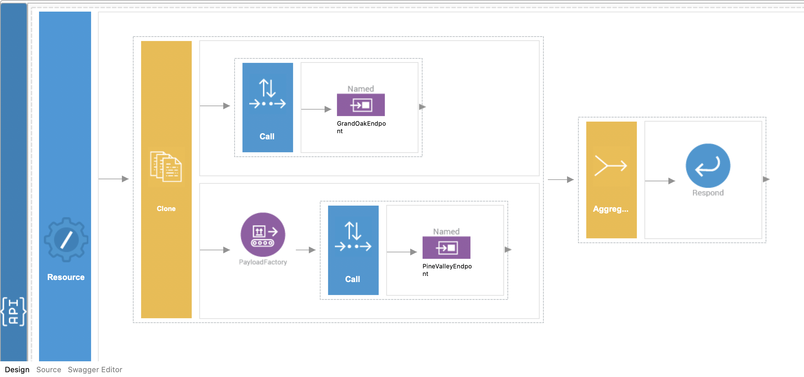

# Quick Start Guide

Let's get started with WSO2 Micro Integrator by running a simple use case in your local environment. This is a simple service orchestration scenario. The scenario is about a basic healthcare system where the Micro Integrator is used to integrate two back-end hospital services to provide information to the client.

Most healthcare centers have a system that is used to make doctor appointments. To check the availability of the doctors for a particular time, users typically need to visit the hospitals or use each and every online system that is dedicated for a particular healthcare center. Here, we are making it easier for patients by orchestrating those isolated systems for each healthcare provider and exposing a single interface to the users.


In the above scenario, the following takes place:

1. The client makes a call to the Healthcare API created using Micro Integrator.

2. The Healthcare API calls the Pine Valley Hospital backend service and gets the queried information.

3. The Healthcare API calls the Grand Oak Hospital backend service and gets the queried information.

4. The response is returned to the client with the required information.

Both Grand Oak Hospital and Pine Valley Hospital have services exposed over the HTTP protocol.

The Pine Valley Hospital service accepts a GET request in the following service endpoint URL.

```bash
http://<HOST_NAME>:<PORT>/pineValley/doctors
```

The Grand Oak Hospital service accepts a GET request in the following service endpoint URL.

```bash
http://<HOST_NAME>:<PORT>/grandOak/doctors/<DOCTOR_TYPE>
```

The expected payload should be in the following JSON format:

```bash
{
        "doctorType": "<DOCTOR_TYPE>"
}
```

Let’s implement a simple integration solution that can be used to query the availability of doctors for a particular category from all the available healthcare centers.

## Before you begin

1. Go to the [website](https://www.wso2.com/integration/micro-integrator) to download the Micro Integrator. When you click **Download**, the installation options will be listed. For this quick start, you can either download and run the **installer**, or use the **binary** file.

    !!! Info
        For more information, see the [installation instructions](../../setup/installation/install_in_vm/).

2. Download the [sample files](https://github.com/wso2/docs-ei/blob/master/en/micro-integrator/docs/assets/attach/quick-start-guide/MI_QSG_HOME-JDK11.zip). From this point onwards, let's refer to this folder as `<MI_QSG_HOME>`.
3. Download [curl](https://curl.haxx.se/) or a similar tool that can call an HTTP endpoint.

## Set up the workspace

To set up the integration workspace for this quick start guide, we will use an integration project that was built using WSO2 Integration Studio:

Go to the `<MI_QSG_HOME>` directory. The following project files and executable backend services are available.

- **HealthcareConfigProject**: This is the ESB Config Project folder with the integration artifacts for the healthcare service. This service consists of the following REST API:
  
  <details>
            <summary>HealthcareAPI.xml</summary>
	    ```xml
            <?xml version="1.0" encoding="UTF-8"?>
            <api context="/healthcare" name="HealthcareAPI" xmlns="http://ws.apache.org/ns/synapse">
                <resource methods="GET" uri-template="/doctor/{doctorType}">
                    <inSequence>
                        <!-- Invoke Grand Oak service with a GET request -->
                        <!-- Construct the payload required for Pine Valley service -->
                        <clone>
                            <target>
                                <sequence>
                                    <call>
                                        <endpoint>
                                            <http method="get" uri-template="http://localhost:9090/grandOak/doctors/{uri.var.doctorType}"/>
                                         </endpoint>
                                    </call>
                                </sequence>
                            </target>
                            <target>
                                <sequence>
                                    <payloadFactory media-type="json">
                                        <format>{
                                                  "doctorType": "$1"
                                                }
                                        </format>
                                        <args>
                                            <arg evaluator="xml" expression="$ctx:uri.var.doctorType"/>
                                        </args>
                                    </payloadFactory>
                                    <!--  Invoke the Pine Valley service with a POST request -->
                                    <call>
                                        <endpoint>
                                            <http method="post" uri-template="http://localhost:9091/pineValley/doctors"/>
                                        </endpoint>
                                    </call>
                                </sequence>
                            </target>
                        </clone>
                        <aggregate>
                            <onComplete expression="json-eval($.doctors.doctor)">
                                <respond/>
                            </onComplete>
                        </aggregate>
                    </inSequence>
                 </resource>
            </api>
	    ```    
  </details>

    !!! Note
        For this scenario, endpoints are defined inline in the API configuration for better clarity in reading the configuration. However, the best practice is to define them as named endpoint configurations so that they can be externalized to an environment specific entity.

- **HealthcareConfigProjectCompositeApplication**: This is the Composite Application Project folder, which contains the packaged CAR file of the healthcare service.

- **Backend**: This contains an executable .jar file that contains mock backend service implementations for the Pine Valley Hospital and Grand Oak Hospital.

## Running the integration artifacts

Follow the steps given below to run the integration artifacts we developed on a Micro Integrator instance that is installed on a VM.

#### Start backend services

Two mock hospital information services are available in the `DoctorInfo-JDK11.jar` file located in the `<MI_QSG_HOME>/Backend/` directory. 

Open a terminal window and use the following command to start the services:

```bash
java -jar DoctorInfo-JDK11.jar
```

#### Deploy the healthcare service

Copy the CAR file of the healthcare service (HealthcareConfigProjectCompositeApplication_1.0.0.car) from the `<MI_QSG_HOME>/HealthcareConfigProjectCompositeApplication/target/` directory to the `<MI_HOME>/repository/deployment/server/carbonapps` directory.

!!! Note
    If you [set up the product](#before-you-begin) using the **installer**, the `<MI_HOME>` [location](../../setup/installation/install_in_vm/#accessing-the-home-directory) is specific to your OS.

#### Start the Micro Integrator

If you [set up the product](#before-you-begin) using the **installer**, follow the steps relevant to your OS as shown below.

-   On **MacOS/Linux/CentOS**, open a terminal and execute the following command:

    ```bash
    sudo wso2mi
    ```
    
-   On **Windows**, go to **Start Menu -> Programs -> WSO2 -> Micro Integrator**. This will open a terminal and start the Micro Integrator.

If you [set up the product](#before-you-begin) using the **binary** file, open a terminal, navigate to the `<MI_HOME>/bin` directory, and execute the command relevant to your OS as shown below.

-   On **MacOS/Linux/CentOS**:

    ```bash
    sh micro-integrator.sh
    ```

-   On **Windows**:

    ```bash
    micro-integrator.bat
    ```

Read more about [starting the Micro Integrator](../../setup/installation/install_in_vm/#running-the-micro-integrator).

#### Invoke the healthcare service

Open a terminal and execute the following curl command to invoke the service:

```bash
curl -v http://localhost:8290/healthcare/doctor/Ophthalmologist
```

Upon invocation, you should be able to observe the following response:

```bash
[ 
   [ 
      { 
         "name":"John Mathew",
         "time":"03:30 PM",
         "hospital":"Grand Oak"
      },
      { 
         "name":"Allan Silvester",
         "time":"04:30 PM",
         "hospital":"Grand Oak"
      }
   ],
   [ 
      { 
         "name":"John Mathew",
         "time":"07:30 AM",
         "hospital":"pineValley"
      },
      { 
         "name":"Roma Katherine",
         "time":"04:30 PM",
         "hospital":"pineValley"
      }
   ]
]
```

## What's next?

- [Develop your first integration solution](../../develop/integration-development-kickstart/).
- Try out the **tutorials** and **examples** available in the [Learn section of our documentation](../../use-cases/integration-use-cases/).
