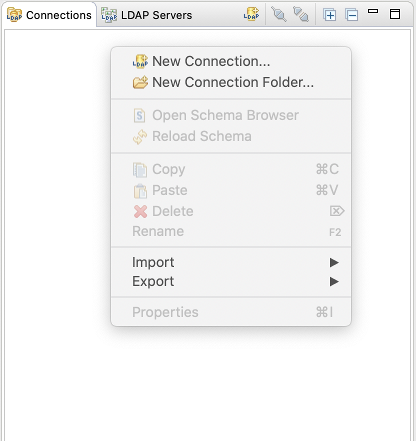
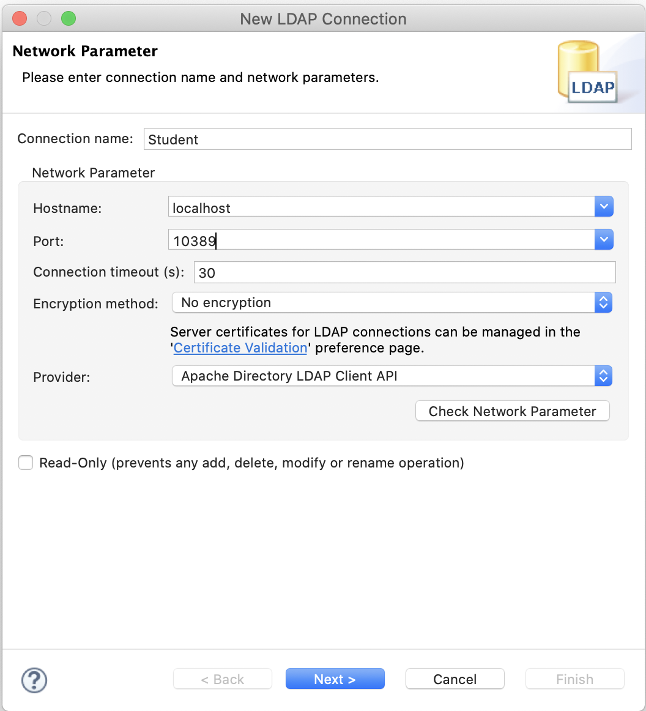
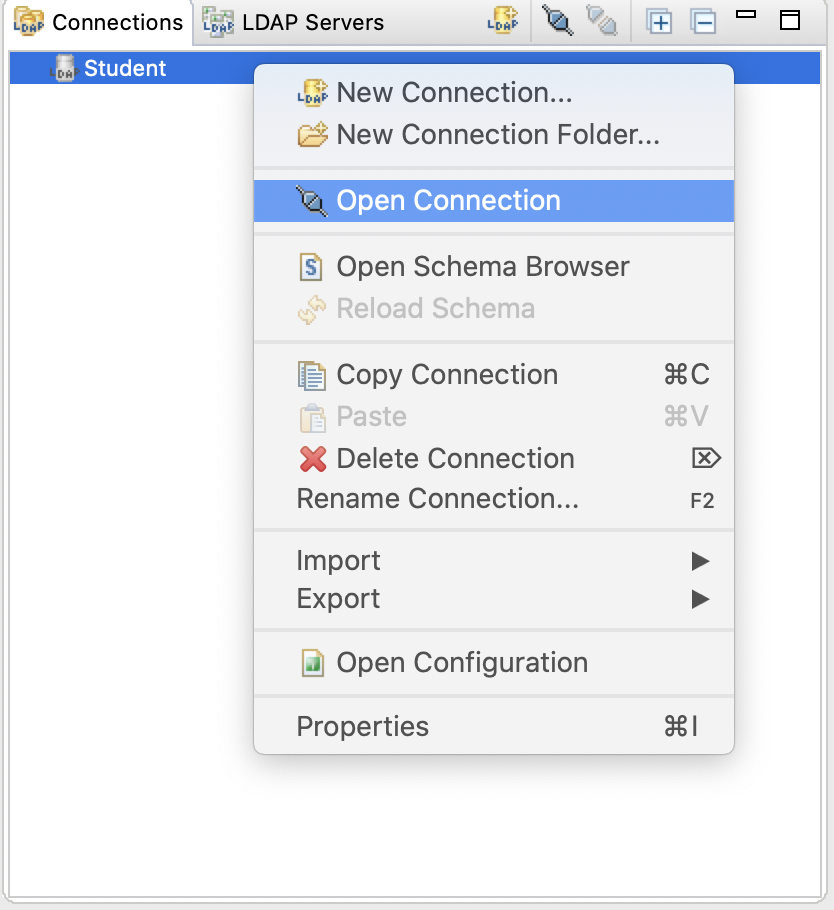

# LDAP Connector Configuration

## Setting up an LDAP Server
WSO2 Identity Server offers an embedded LDAP as a primary user store. Download Identity Server from 
[here](https://wso2.com/identity-and-access-management/) and start the server. See 
[Quick Start Guide](https://is.docs.wso2.com/en/5.10.0/get-started/quick-start-guide/)

### Apache Directory Studio

1. Download Apache Directory Studio from [here](http://directory.apache.org/studio/) and open.
2. Right click on the LDAP Servers tab found on the bottom left corner and click **New Connection**.
    
3. Configure network parameters as follows and click next.
    
4. Provide authentication parameters as follows and click finish.
    * Bind DN or user parameter - **uid=admin,ou=system**
    * Bind password - **admin**
5. Right click on newly created connection and select **Open Connection**.
    

### init
```xml
<ldap.init>
    <providerUrl>{$ctx:providerUrl}</providerUrl>
    <securityPrincipal>{$ctx:securityPrincipal}</securityPrincipal>
    <securityCredentials>{$ctx:securityCredentials}</securityCredentials>
    <secureConnection>{$ctx:secureConnection}</secureConnection>
    <disableSSLCertificateChecking>{$ctx:disableSSLCertificateChecking}</disableSSLCertificateChecking>
</ldap.init>
```

**providerUrl** : The URL of the LDAP server.</br>
**securityPrincipal** : The Distinguished Name(DN) of the admin of the LDAP Server.</br>
**securityCredentials** : The password of the LDAP admin.</br>
**secureConnection** : The boolean value for the secure connection.</br>
**disableSSLCertificateChecking** : The boolean value to check whether the certificate is enabled or not.</br>

You can follow the steps below to import your LDAP certificate into wso2ei client’s keystore as follows:

1. To encrypt the connections, you need to configure a certificate authority (https://www.digitalocean.com/community/tutorials/how-to-encrypt-openldap-connections-using-starttls) 
and use it to sign the keys for the LDAP server.
2. Use the following command to import the certificate into the EI client keystore. 
   ```bash
   keytool -importcert -file <certificate file> -keystore <EI>/repository/resources/security/client-truststore.jks -alias "LDAP"
   ```
3. Restart the server and deploy the LDAP configuration.

#### Ensuring secure data
Secure Vault is supported for encrypting passwords. See, 
[Working with Passwords](https://docs.wso2.com/display/ADMIN44x/Encrypting+Passwords+with+Cipher+Tool) on integrating 
and using Secure Vault.

#### Re-using LDAP configurations

You can save the LDAP configuration as a [local entry](../../../develop/creating-artifacts/registry/creating-local-registry-entries.md) 
and then easily reference it with the configKey attribute in your operations. For example, if you saved the above 
**<ldap.init>** entry as a local entry named MyLDAPConfig, you could reference it from an operation like addEntry as follows:
    ```xml
    <ldap.addEntry configKey="MyLDAPConfig"/>
    ```
