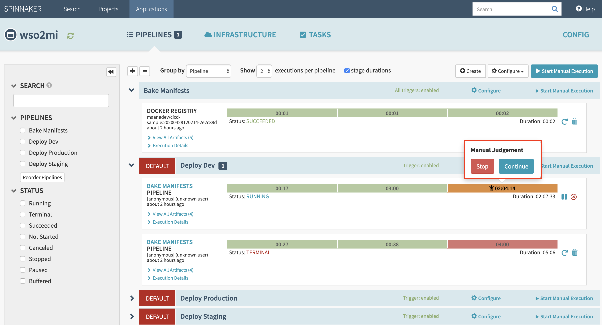
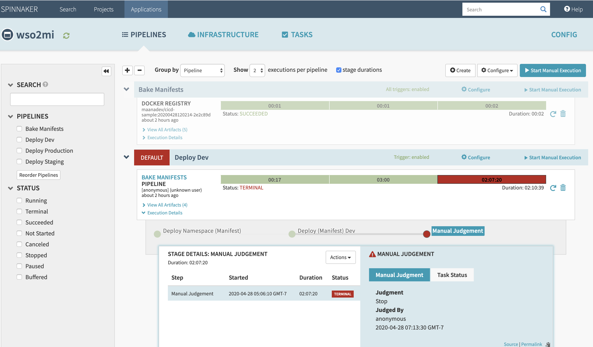

# Adding test cases

## Add your own test case to the Kubernetes Pipeline
This guide demonstrates how you can add test cases.Further, the guide assumes that you have completed the instructions in the
following pages.

1.  [Quick Start Guide](/setup/deployment/k8s-pipeline/quick-start-guide/)

2.  [Testing The Pipeline
    Environment](/setup/deployment/k8s-pipeline/testing-the-pipeline-environment/)

Test cases are available in the [chart source repository](https://github.com/wso2-incubator/cicd-sample-chart-mi.) under a
directory named `tests`. 

1.  Create a fork of the [sample chart source
    repository](https://github.com/wso2-incubator/cicd-sample-chart-mi).

2.  Create a clone of the forked chart source repository using the
    following command.
    
    ``` xml
    $ git clone https://github.com/<ORGANIZATION_NAME>/cicd-sample-chart-mi.git
    ```

    
   Replace the `<ORGANIZATION_NAME>` tag with the name of your GitHub
    organization.

3.  In the sample chart repository, observe the sample test script
    provided in Navigate to 
    [cicd-sample-chart-mi/tests](https://github.com/wso2-incubator/cicd-sample-chart-mi) and
    click **test.sh.**
    
    This script in the test.sh file checks if the server has
    successfully started by performing health checks on Micro Integrator
    endpoints. If the desired response is any of the provided
    endpoints, are not met, the script throws a non-zero exit code
    causing the test to fail.

4.  Uncomment the commented code block and remove the last line in the
    sample test script.
    
    ``` xml
     endpoint=http://wso2mi-staging-micro-integrator.wso2mi-staging.svc.cluster.local:8290/services/HelloWorld
     response=$(curl --write-out %{http_code} --silent --output /dev/null -k $endpoint);
    
     if [ $response -eq 200 ]
     then
         echo "Test Passed";
         exit 0;
     else
         echo "Test Failed";
         exit 1;
     fi
    
    # exit 0
    ```

5.  Change the chart repository in the
    sample [values](https://raw.githubusercontent.com/wso2/kubernetes-pipeline/master/samples/values-mi.yaml) file
    used in the [Quick Start
    Guide](/setup/deployment/k8s-pipeline/quick-start-guide/)
    to use a custom chart.
    
    ``` xml
     applications:
        - name: wso2mi
          email: <EMAIL>
          testScript:
          path: tests
          command: test.sh
          chart:
          customChart: true
          name: micro-integrator
          version: 1.2.0-1
          repo: 'https://github.com/<ORGANIZATION_NAME>/cicd-sample-chart-mi'
    ```

6.  Upgrade the Helm chart with the command below, providing the
    modified sample values file.
    
    ``` xml
    $ helm upgrade <RELEASE_NAME> wso2/kubernetes-pipeline -f values-mi.yaml
    ```
    
    !!! Info
        This may take up to 10 minutes.
    
 

7.  Commit and push the changes in your forked chart source repository.
    
    ``` xml
    $ git add .
    $ git commit -m "Add health check test cases"
    $ git push origin master 
    ```

8.  Stop the manual judgment in any existing environments and watch the
    deployment of the setup with test cases being deployed in the
    Spinnaker dashboard.
    
    [  ](../../../assets/img/k8s_pipeline/testcases/testcases-mi1.png)
    [  ](../../../assets/img/k8s_pipeline/testcases/testcases-mi2.png)
    [  ](../../../assets/img/k8s_pipeline/testcases/testcases-mi3.png)
