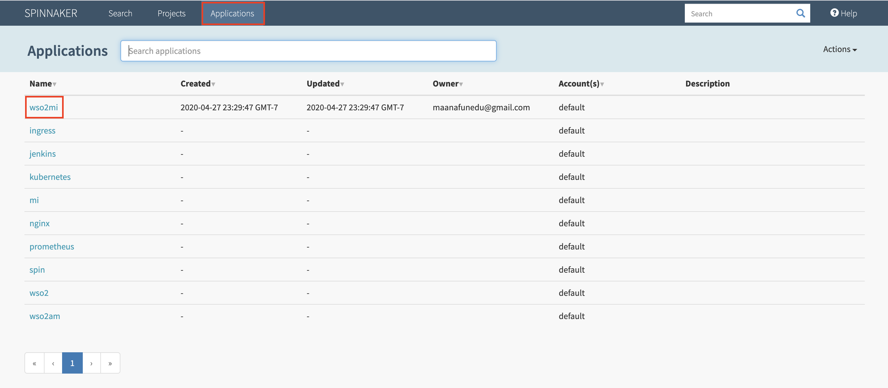
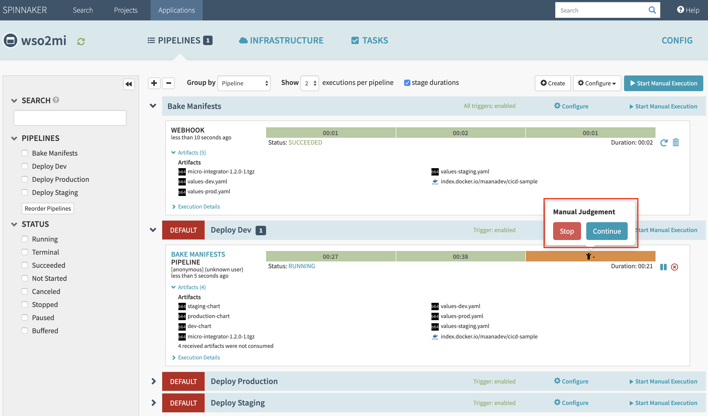
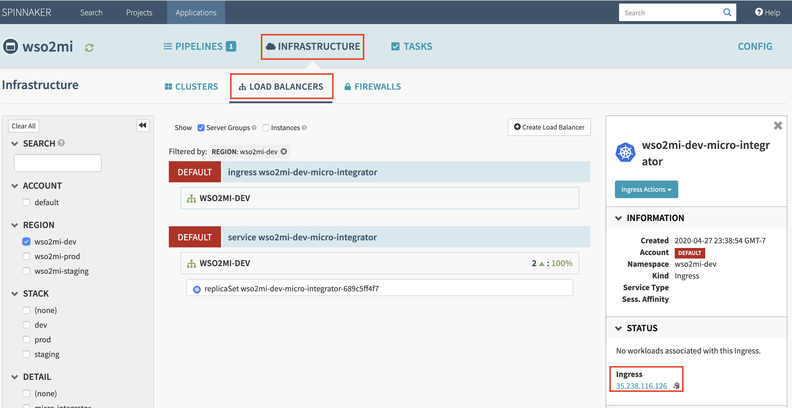
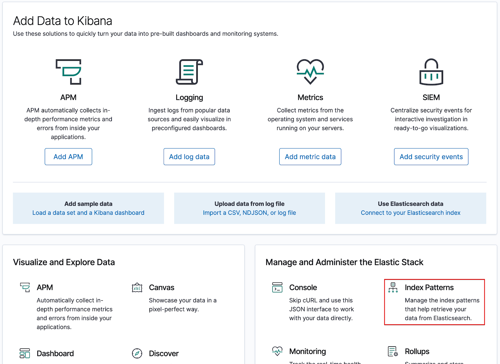
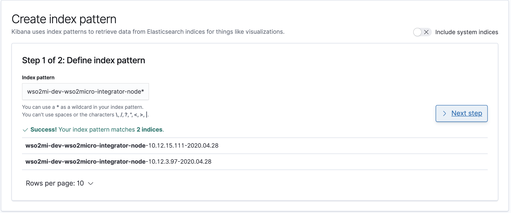
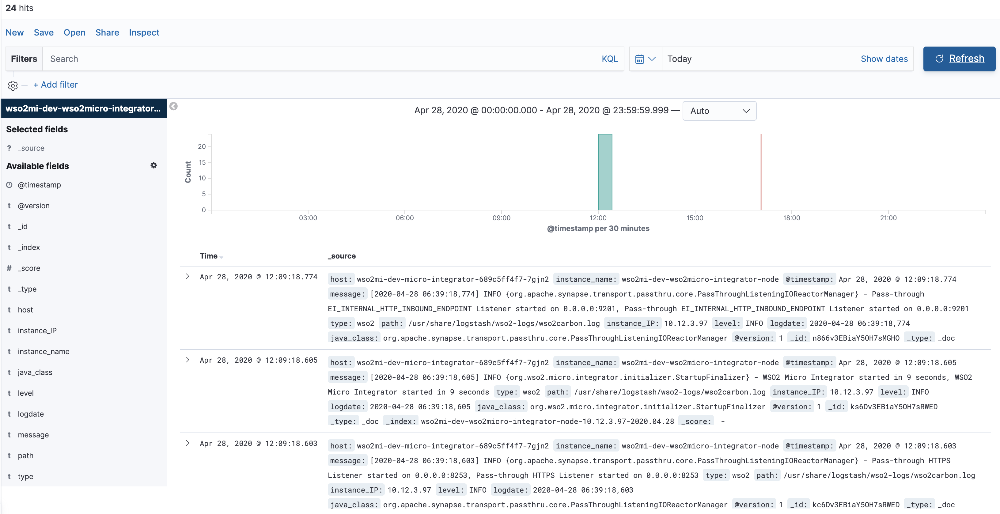

# Testing The Pipeline Environment

1.  Explore the Spinnaker Dashboard.
    
    Navigate to the Spinnaker dashboard
    at `https://spinnaker.example.com`and
    select **Applications > wso2mi > Pipelines**.
    
    [  ](../../../assets/img/k8s_pipeline/testing_pipeline/testing-mi-2.png)
    
    which will navigate to the pipeline page 
    
    [  ](../../../assets/img/k8s_pipeline/testing_pipeline/test-mi-3.png)
    
    The Spinnaker dashboard for a particular product shows the progress
    of the deployment.
    
    You are presented with three pipelines where one is active.
    
    1.  **Deploy Dev** : Pipeline responsible for executing the tasks in
        deploying the changes to Dev environment and it's active by
        default. 
    
    2.  **Deploy Staging** : Pipeline responsible for executing the tasks in
        deploying the changes to the Staging environment.
    
    3.  **Deploy Prod** : Pipeline responsible for executing the tasks in
        deploying the changes to the Production environment.
    
    Once the changes have been deployed to the Dev environment, you will
    be prompted to provide a manual input in order to proceed and to
    make a deployment to Staging.
    
    [  ](../../../assets/img/k8s_pipeline/testing_pipeline/test-mi-4.png)
    
    Before proceeding with the manual judgment, let's examine our WSO2
    Micro Integrator deployment in the Dev environment.
    
    Navigate to **Infrastructure tab > Load Balancers > ingress
    wso2mi-dev-micro-integrator.**
    
    [  ](../../../assets/img/k8s_pipeline/testing_pipeline/test-mi-5.png)
    
    Ingress information of current deployments can be observed here. The
    Ingress IP address of the Micro Integrator Dev environment can be
    obtained from the sidebar to the right.

## Invoking Services

Send the following request through a Curl command and observe the
output.

``` xml
$ curl -k https://mi.dev.wso2.com/services/HelloWorld  
You will get the following response: {"Hello":"World"}

```
You have deployed WSO2 Micro Integrator into your Development
environment! For more information on using WSO2 Micro Integrator, please take a look
at our [documentation.](/overview/introduction/)

## Logging

Logging function is implemented in the pipeline utilizing resources
provided by Elastic search and Kibana.

The Kibana dashboard can be accessed by navigating
to `https://kibana.example.com` on a browser of choice.

In the dashboard, `select Index Patterns,and Click Create index
pattern.`

[ ](../../../assets/img/k8s_pipeline/testing_pipeline/test-mi-6.png)
[ ](../../../assets/img/k8s_pipeline/testing_pipeline/test-mi-7.png)
  

Let’s observe the logs in the Analytics Dashboard.

To do so, provide **wso2mi-dev-wso2micro-integrator-node** as an index
pattern, and` select Next step`

Thereafter, create a filter providing the `@timestamp` field name.
[](../../../assets/img/k8s_pipeline/testing_pipeline/test-mi-8.png)

Once the **index pattern** is created, Analytics Dashboard logs can be
observed by clicking the `Discover button` on the left of the page.

[ ](../../../assets/img/k8s_pipeline/testing_pipeline/test-mi-9.png)

!!! tip
    If no results are visible, expand your time range by selecting the desired range on the top left of the dashboard.
