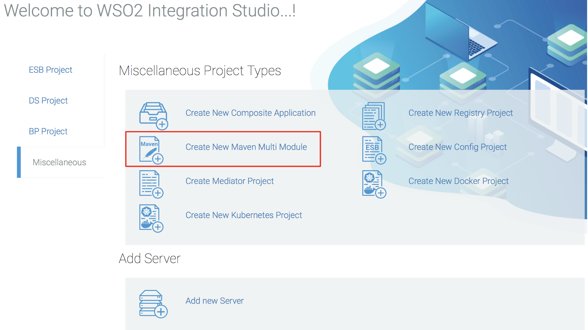
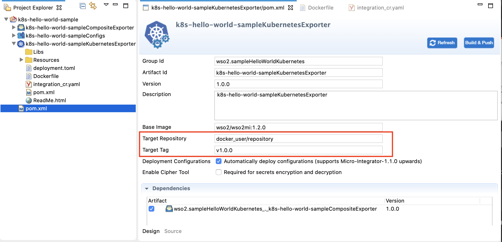

# K8s Deployment Sample 1: Hello World Scenario
Let's define a basic Hello World scenario using WSO2 Micro Integrator and deploy it on your Kubernetes environment.

## Prerequisites

-   Install and set up [WSO2 Integration Studio](../../../../develop/installing-WSO2-Integration-Studio).
    
    !!! Tip
        Be sure to [get the latest updates](../../../../develop/installing-WSO2-Integration-Studio#get-the-latest-updates) before trying this example.
        
-   Install a [Kubernetes](https://kubernetes.io/docs/setup/) cluster and **v1.11+** client. Alternatively, you can [run Kubernetes locally via Minikube](https://kubernetes.io/docs/setup/learning-environment/minikube/).
-   Install [Docker](https://docs.docker.com/).
-   Install the [EI Kubernetes operator](../../../../setup/deployment/kubernetes_deployment#install-the-ei-k8s-operator).

## Step 1: Create the integration solution

Follow the steps given below.

1.  Create a Maven Multi Module project using WSO2 Integration Studio.

     
    
2.  Create an **ESB Config Project** inside the Maven Multi Module project:
    
    Right-click the Maven Multi Module project in the project explorer, go to **New → Project**, and select **ESB Config Project** to open the **New ESB Config Project** dialog.

    
        
3.  Add the following proxy service configuration inside the ESB Config Project. This will return the "{"Hello":"World"}" response payload for the service request.

    1.  Right-click the ESB Config project in the project explorer, go to **New -> Proxy Service** and create a custom proxy service named `HelloWorld`. 
        

    2.  You can then use the **Source View** to copy the following configuration.
        ```xml
        <?xml version="1.0" encoding="UTF-8"?>
        <proxy name="HelloWorld" startOnLoad="true" transports="http https" xmlns="http://ws.apache.org/ns/synapse">
            <target>
                <inSequence>
                    <payloadFactory media-type="json">
                        <format>{"Hello":"World"}</format>
                        <args/>
                    </payloadFactory>
                    <respond/>
                </inSequence>
                <outSequence/>
                <faultSequence/>
            </target>
        </proxy>
        ```

4.  Create a **Composite Application Project** with the above proxy service inside the Maven Multi Module project.

    1.  Right-click the maven multi modiule project, go to **New → Project**, select **Composite Application Project**, and click **Next**.
    2.  Be sure to select the proxy service under **Dependencies** as shown below.
        

    3.  Click **Finish**.

5.  Create a **Kubernetes Project** inside the Maven Multi Module Project. 

    1.  Right-click the Maven Multi Module project, go to **New → Project**, select **Kubernetes Exporter Project**, and click **Next**.
        
    2.  In the **Kubernetes Project Information** dialog that opens, enter the following details:
        <table>
            <tr>
                <th>
                    Parameter
                </th>
                <th>
                    Description
                </th>
            </tr>
            <tr>
                <td>
                    Kubernetes Project Name
                </td>
                <td>
                   Give a unique name for the project. 
                </td>
            </tr>
            <tr>
                <td>
                    Integration Name
                </td>
                <td>
                    This name will be used to identify the integration solution in the kubernetes custom resource. Let's use <code>hello-world</code> as the integration name for this example.
                </td>
            </tr>
            <tr>
                <td>
                    Number of Replicas
                </td>
                <td>
                    Specify the number of pods that should be created in the kubernetes cluster.
                </td>
            </tr>
            <tr>
                <td>
                    Base Image Repository
                </td>
                <td>
                    The Docker repository to which the Docker image will be pulled to create the target image: 'docker_user_name/repository_name'.
                </td>
            </tr>
            <tr>
                <td>
                    Base Image Tag
                </td>
                <td>
                    Give a tag name for the base Docker image.
                </td>
            </tr>
            <tr>
                <td>
                    Target Image Repository
                </td>
                <td>
                    The Docker repository to which the Docker image will be pushed: 'docker_user_name/repository_name'.
                </td>
            </tr>
            <tr>
                <td>
                    Target Image Tag
                </td>
                <td>
                    Give a tag name for the Docker image.
                </td>
            </tr>
        </table>
        
!!!Tip
With the new version we’ve provided the functionality to use custom base images to be pulled from a docker repository. This can be used in below 3 scenarios.

1. Pull from a public docker repository as the base image
You can just add the Docker repository to which the Docker image will be pulled to create the target image: 'docker_user_name/repository_name'
 
2. Pull from private Docker repository as the base image
Open the console of the relevant OS and run the following command.
 
    ```bash 
    docker login -u username -p password 
    ```

    Then provide the docker repository which will be used to pull the base image.

3. If the image you are going to pull is already in local Docker registry

    If the image you are going to pull is already in local Docker registry,  by default,  it will compare the current latest image in the repository and if there are changes it will pull the newer image from the repository. This will cause some change conflicts if you are already using an older docker image. In such scenarios (using a custom image which created inside your local Docker registry) you need to add the following property under the dockerfile-maven-plugin > executions > execution > configurations in the  pom.xml file which located inside the Docker Exporter Project. 
    
    ```xml
    <pullNewerImage>false</pullNewerImage>
   ```
    
    This will stop comparing the image with the latest tag and pulling it. Example plugin config after adding the property is given below.
    ```xml
      <plugin>
        <groupId>com.spotify</groupId>
        <artifactId>dockerfile-maven-plugin</artifactId>
        <version>1.4.3</version>
        <extensions>true</extensions>
        <executions>
          <execution>
            <goals>
              <goal>build</goal>
              <goal>push</goal>
            </goals>
            <configuration>
              <username>${username}</username>
              <password>${password}</password>
              <repository>docker/helloworld</repository>
              <tag>1.1.0</tag>
              <pullNewerImage>false</pullNewerImage> 
            </configuration>
          </execution>
        </executions>
        <configuration/>
      </plugin>
    ```
          
    
Finally, the created Maven Multi Module project should look as follows:


## Step 2: Package and build the solution  

You need to build a Docker image of the integration solution and push it to your Docker registry.
      
1.  Start the Docker daemon in the host machine.
2.  Open the **pom.xml** file in the Kubernetes project, ensure that the composite application is selected under **Dependencies**, and click **Build and Push**.
    
    
    The deployment configurations can be automatically deployed if you check the automatically deploy configurations. Please note that this is supported only on MI 1.1.0 or upwards.
    
    In the dialog that opens, enter the credentials of your Docker registry to which the image should be pushed.

    

    !!! Info
        Alternatively, you can build the Docker image and push it to the Docker registry as follows:

        1.  Navigate to the Maven Multi Module project and run the following command to build the project. It will create a docker image with the provided target repository and tag once the build is successfull.
            ```bash
            mvn clean install -Dmaven.test.skip=true
            ```
        2.  Navigate to the Kubernetes project inside the MavenParentProject and run the following command to push the docker image to the remote docker registry.
            ```bash
            mvn dockerfile:push -Ddockerfile.username={username} -Ddockerfile.password={password}
            ``` 

3.  Run the `docker image ls` command to verify that the Docker image is created.
    
## Step 3: Deploy the solution in K8s

!!! Info
    **Before you begin**, be sure that the [system requrements](../../../../setup/deployment/kubernetes_deployment#prerequisites-system-requirements) are in place, and that the [EI Kubernetes Operator](../../../../setup/deployment/kubernetes_deployment#install-the-ei-k8s-operator) is installed.

Follow the steps given below.

1.  Open the `integration_cr.yaml` file from the Kubernetes project in WSO2 Integration Studio.
2.  See that the **integration** details of the `hello-world` solution are updated:

    ```yaml
    apiVersion: "integration.wso2.com/v1alpha2"
    kind: "Integration"
    metadata:
      name: "hello-world"
    spec:
      replicas: 1
      image: "<Docker image for the Hello World Scenario>"
    ```

3.  Open a terminal, navigate to the location of your `integration_cr.yaml` file, and execute the following command to deploy the integration solution in the Kubernetes cluster:
    ```bash
    kubectl apply -f integration_cr.yaml
    ``` 

When the integration is successfully deployed, it should create the `hello-world` integration, `hello-world-deployment`, `hello-world-service`, and `ei-operator-ingress` as follows:

!!! Tip
    The `ei-operator-ingress` will not be created if you have [disabled the ingress controller](../../../../setup/deployment/kubernetes_deployment#disable-ingress-controller).

```bash
kubectl get integration

NAME          STATUS    SERVICE-NAME    AGE
hello-world   Running   hello-service   2m

kubectl get deployment

NAME                     READY   UP-TO-DATE   AVAILABLE   AGE
hello-world-deployment   1/1     1            1           2m

kubectl get services
NAME                     TYPE        CLUSTER-IP       EXTERNAL-IP   PORT(S)       AGE
hello-world-service      ClusterIP   10.101.107.154   <none>        8290/TCP      2m
kubernetes               ClusterIP   10.96.0.1        <none>        443/TCP       2d
k8s-ei-operator          ClusterIP   10.98.78.238     <none>        443/TCP       1d

kubectl get ingress
NAME                  HOSTS     ADDRESS     PORTS     AGE
ei-operator-ingress   wso2ei    10.0.2.15   80, 443   2m
```

## Step 4: Test the deployment

Let's invoke the service without going through the ingress controller.

1.  Apply port forwarding as shown below. This will allow you to invoke the service without going through the Ingress controller:
    ```bash
    kubectl port-forward service/hello-world-service 8290:8290
    ```

2.  Invoke the service as follows:
    ```bash
    curl http://localhost:8290/services/HelloWorld
    ```  

You will receive the following response:

```bash
{"Hello":"World"}%
```
