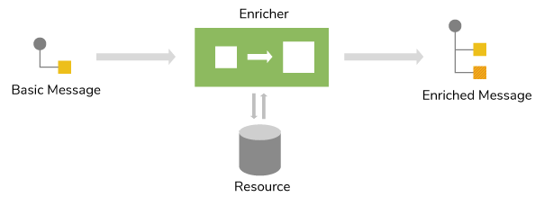

# About Integration Use Cases

WSO2 Micro Integrator helps you build and execute the following use cases.

## Message Routing

When a message is received by WSO2 Micro Integrator, it can route the message to an intended recipient. Routing can also be done based on some component of the message. This is known as
content-based routing.

## Message Filtering

WSO2 Micro Integrator is able to filter out messages based on the message content and apply complex messaging logic. For example, you can filter out messages and send them in different mediation flows.

## Message Transformation

When sender and receiver messages do not have the same data format, the WSO2 Micro Integrator can be used to translate the messages between the sender and recipient. You can manipulate messages by adding and
removing content, converting them to a completely different message format, and even validating messages based on the available validation mechanisms of the message format.

  

## Content Enriching

WSO2 Micro Integrator processes a message based on a given source configuration and then performs a specified action on the message by using the target configuration. It gets an OMElement using the configuration specified in the source and then modifies the message by putting it on the current message using the configuration in the target.

  

## Protocol Switching

The WSO2 Micro Integrator has the ability to receive messages in one protocol and then send the message out in a completely different protocol (e.g. HTTP to JMS). The protocol bridging technology in the Micro Integrator takes the business content of a message that comes in from one protocol and sends this content out in a completely different format and protocol.

  

## Service Chaining

Service chaining (orchestration) is a popular use case in the enterprise integration, where several services are exposed as a single, aggregated service. WSO2 Micro Integrator is used for the integration and sequential calling of these services so that the expected response can be provided to the client.

## Message Storing and Forwarding

Store and forward messaging pattern is used in asynchronous messaging. This can be used when integrating with systems that accept message traffic at a given rate and handling failover scenarios. In this
pattern, messages are sent to a **message store** where they are temporarily stored before they are delivered to their destination by a **message store**. WSO2 Micro Integrator is shipped with a few message store
implementations and also allows you to implement a custom message store implementation.

