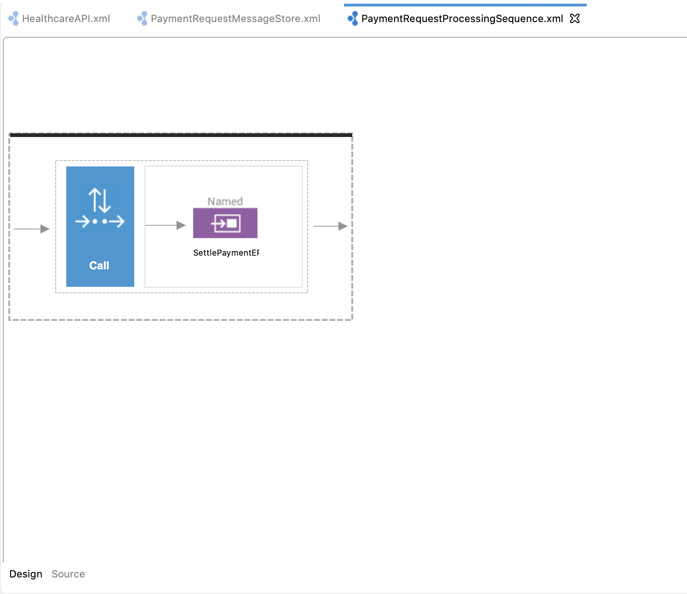
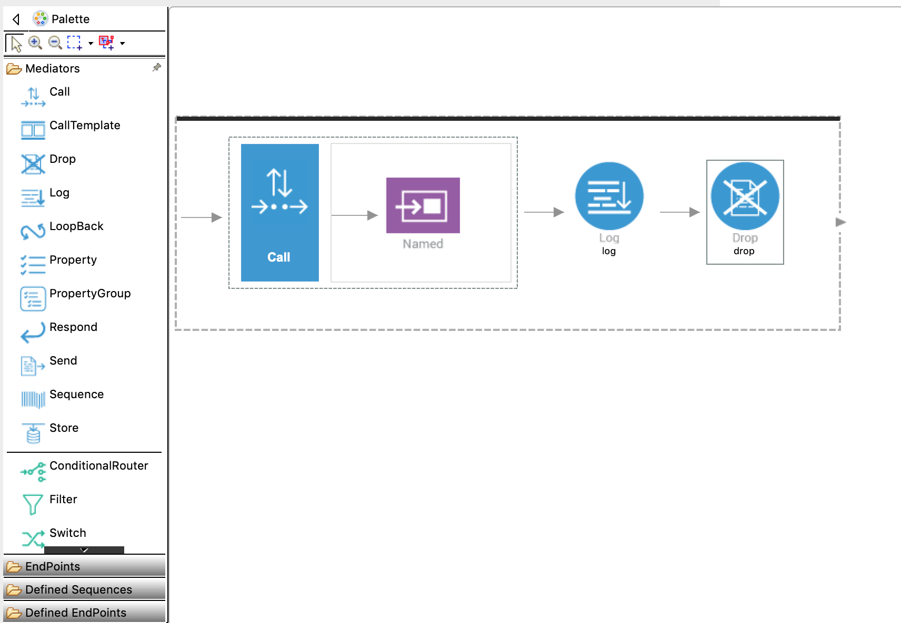
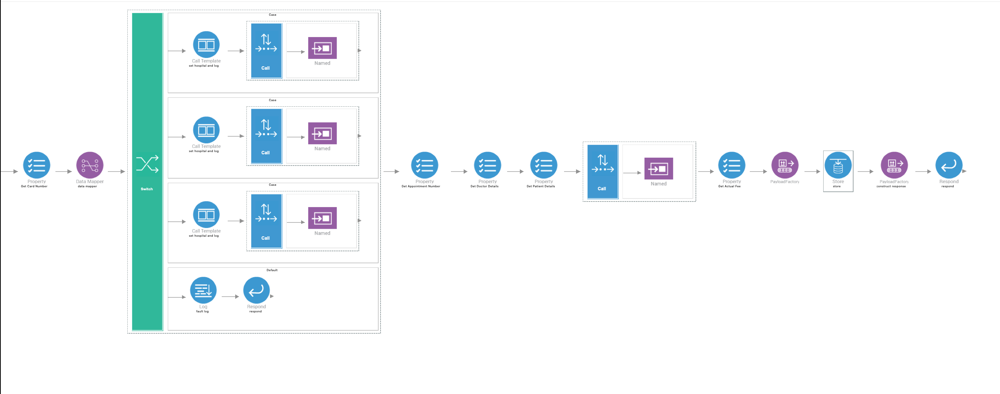

# Asynchronous Messaging

## What you'll build
Store and forward messaging is used for serving traffic to back-end services that can accept request messages only at a given rate. This is also used to ensure guaranteed delivery of messages. Messages never get lost since they are stored in the message store and available for future reference.

**In this tutorial**, instead of sending the request directly to the back-end service, you store the request message in the RabbitMQ broker. You will then use a **Message
Processor** to retrieve the message from the store before delivering it to the back-end service.

## Let's get started!

### Step 1: Set up the workspace

Set up WSO2 Integration Studio as follows:

1.  Download the relevant [WSO2 Integration Studio](https://wso2.com/integration/tooling/) based on your operating system.
2.  If you did not try the [Exposing Several Services as a Single Service](exposing-several-services-as-a-single-service.md) tutorial yet:
    1.  Open WSO2 Integration Studio and go to **File -> Import**. 
    2.  Select **Existing WSO2 Projects into workspace** under the **WSO2** category, click **Next**, and then upload the [pre-packaged project](https://github.com/wso2-docs/WSO2_EI/blob/master/Integration-Tutorial-Artifacts/Integration-Tutorial-Artifacts-EI7.1.0/service-orchestration-tutorial.zip).

### Step 2: Develop the integration artifacts

#### Create the Message Store

Now, let's create a Message Store artifact to represent the broker.

1.  Right-click **SampleServices** in the Project Explorer and navigate to **New->Message Store**.
2.  Select **Create a new message-store artifact** and specify the following details:

    <table>
    <tr>
        <th>Property</th>
        <th>Value</th>
        <th>Description</th>
    </tr>
    <tr>
    <td>Message Store Name</td>
    <td><code>PaymentRequestMessageStore</code></td>
    <td>The name of the message store.</td>
    </tr>
    <tr>
    <td>Message Store Type</td>
    <td>RabbitMQ Message Store</td>
    <td>An instance of RabbitMQ server will be used as the broker.</td>
    </tr>
    <tr>
    <td>RabbitMQ Server Host Name</td>
    <td><code>localhost</code></td>
    <td>The address of the RabbitMQ broker</td>
    </tr>
    <tr>
    <td>RabbitMQ Server Port</td>
    <td><code>5672</code></td>
    <td>The port number of the RabbitMQ message broker.</td>
    </tr>
    <tr>
    <td>RabbitMQ Queue Name</td>
    <td>PaymentRequestJMSMessageStore</td>
    <td>The name of the RabbitMQ exchange to which the queue is bound.</td>
    </tr>
    <tr>
    <td>RabbitMQ Exchange Name</td>
    <td>exchange</td>
    <td>The name of the RabbitMQ exchange to which the queue is bound.</td>
    </tr>
    <tr>
    <td>Routing Key</td>
    <td>key</td>
    <td>The exchange and queue binding value.</td>
    </tr>
    <tr>
    <td>User Name</td>
    <td>user name</td>
    <td>The user name to connect to the broker.</td>
    <tr>
    <td>Password</td>
    <td>password</td>
    <td>The password to connect to the broker.</td>
    </tr>
    </table>

    

3.  Click **Finish**.

#### Create the Response sequence

Let's create a Sequence that uses the message in the message store to send the request to SettlePaymentEP.

1.  Right click the **SampleServices** project in the Project Explorer and navigate to **New -> Sequence**. 
2.  Select **Create New Sequence** and give **PaymentRequestProcessingSequence** as the name.

      

3.  Click **Finish**.

4.  In the sequence you have created (in the previous step), drag and drop a Call mediator from the **Mediators** palette 
and add SettlePaymentEP from the **Defined 
Endpoints** palette to the empty box adjoining the Call mediator. This sends the request message from the store to SettlePaymentEP.

    

4.  Drag and drop a Log mediator from the **Mediators** palette to log the response from SettlePaymentEP. Access the **Property** tab and specify the following details:

    | Field        | Value           |
    |--------------|-----------------|
    | Log Category | INFO |
    | Log Level    | FULL |

4.  Add a Drop mediator from the **Mediators** palette. You should now have a completed sequence configuration that looks like this:

    

5.  Save the updated sequence configuration.


#### Create the Message Processor

Let's create a **Message Sampling Processor** to dispatch the request message from the **Message Store** to the **PaymentRequestProcessingSequence**.

!!! Info
    You can also use the **Scheduled Message Forwarding Processor** here and define the endpoint within the processor. The Message Sampling Processor is used because you need to perform mediation on the request message in the next tutorial.

1.  Right-click the **SampleServices** project in the Project Explorer and navigate to **New -> Message Processor**. Select **create a new message-processor artifact** and specify the details shown below:
    <table>
        <tr class="header">
        <th>Property</th>
        <th>Value</th>
        <th>Description</th>
        </tr>
        <tr class="odd">
        <td>Message Processor Type</td>
        <td>Message Sampling Processor</td>
        <td><p>This processor takes the message from the store and puts it into a sequence.</p></td>
        </tr>
        <tr class="even">
        <td>Message Processor Name</td>
        <td>PaymentRequestProcessor</td>
        <td>The name of the scheduled message forwarding processor.</td>
        </tr>
        <tr class="odd">
        <td>Message Store</td>
        <td>PaymentRequestMessageStore</td>
        <td>The message store from which the scheduled message forwarding processor consumes messages.</td>
        </tr>
        <tr class="even">
        <td>Processor State</td>
        <td>Activate</td>
        <td>Whether the processor needs to be activated or deactivated.</td>
        </tr>
        <tr class="odd">
        <td>Sequence</td>
        <td><div class="content-wrapper">
        <p>Follow the steps given below:</p>
        <ol>
        <li>Click <strong>Browse.</strong></li>
        <li>Click the <strong>workspace</strong> link.</li>
        <li>Click <strong>Carbon Application Sequences &gt; SampleServices</strong> .</li>
        <li>Select <strong>PaymentRequestProcessingSequence</strong> and click <strong>OK</strong>.</li>
        </ol>
        </div></td>
        <td>The name of the sequence to which the message from the store needs to be sent.</td>
        </tr>
    </table>

    

2.  Click **Finish**.

#### Update the mediation flow

Let's update the REST API so that the messages sent to SettlePaymentEP is forwarded to the message store we created above.

1.  Drag and add a **Store** mediator from the mediators palette just after the PayloadFactory mediator.

    

2.  With the Store mediator selected, access the **Property** tab and specify the following details:

    | Field                   | Description                                                       |
    |-------------------------|-------------------------------------------------------------------|
    | Available Message Store | Select **PaymentRequestMessageStore**                             |
    | Message Store           | Double click to populate the value **PaymentRequestMessageStore** |
    | Description             | Payment Store                                                     |

3.  Let's use a **PayloadFactory** mediator to send a customized response
    message to the client.
    
    Delete the Call mediator by right-clicking on the mediator and selecting **Delete from Model**. Replace this with a PayloadFactory mediator from the Mediators palette to configure the response to be sent to the client. 

4.  With the PayloadFactory mediator selected, access the Property tab and fill in the information in the following table to define a customized message to be returned to the client.

    !!! Tip
        To avoid getting an error message, first select **Media Type** before selecting **Payload**.

    | Field          | Value                                                                                                  |
    |----------------|--------------------------------------------------------------------------------------------------------|
    | Media Type     | json                                                                                                   |
    | Payload Format | Inline                                                                                                 |
    | Payload        | `{"message":" Payment request successfully submitted. Payment confirmation will be sent via email ."}` |

    
You should now have a completed configuration that looks like this:  



We have now finished creating all the required artifacts.

### Step 3: Package the artifacts

Package the artifacts in your composite application project (SampleServicesCompositeExporter module) and the registry resource project (SampleRegistryResources module) to be able to deploy the artifacts in the server.

1.  Open the `          pom.xml         ` file in the composite application project POM editor.
2.  Ensure that the following projects and artifacts are selected in the POM file.

    -   SampleServicesCompositeExporter
        -   `HealthcareAPI`
        -   `ClemencyEP`
        -   `GrandOakEP`
        -   `PineValleyEP`
        -   `ChannelingFeeEP`
        -   `SettlePaymentEP`
        -   `PaymentRequestMessageStore`
        -   `PaymentRequestProcessingSequence`
        -   `PaymentRequestProcessor`
    -   SampleServicesRegistryProject

3.  Save the project.

### Step 4: Build and run the artifacts

To test the artifacts, deploy the [packaged artifacts](#step-3-package-the-artifacts) in the embedded Micro Integrator:

1.  Right-click the composite exporter module and click **Export Project Artifacts and Run**.
2.  In the dialog box that opens, confirm that the required artifacts from the composite exporter module are selected.     
4.  Click **Finish**. 

The artifacts will be deployed in the embedded Micro Integrator and the server will start.

- See the startup log in the **Console** tab.
- See the URLs of the deployed services and APIs in the **Deployed Services** tab.

!!! Warning
    Stop the Micro Integrator before proceeding to test. This is because you need to start the broker profile before starting the Micro Integrator.

### Step 5: Test the use case

Let's test the use case by sending a simple client request that invokes the service.

#### Start the back-end service

1. Download the JAR file of the back-end service from [here](https://github.com/wso2-docs/WSO2_EI/blob/master/Back-End-Service/Hospital-Service-JDK11-2.0.0.jar).
2. Open a terminal, navigate to the location where your saved the back-end service.
3. Execute the following command to start the service:

    ```bash
    java -jar Hospital-Service-JDK11-2.0.0.jar
    ```

#### Start the RabbitMQ Broker
    
Make sure that you have installed and started a RabbitMQ server instance for the Micro-Integrator to communicate with.

See the [RabbitMQ documentation](https://www.rabbitmq.com/download.html) for more information on how to install and run the product.

#### Restart the Micro Integrator

Let's restart the Micro Integrator with the deployed artifacts:

Right-click the composite application project and click **Export Project Artifacts and Run** as shown below.


#### Send the client request

Let's send a request to the API resource. You can use the embedded <b>HTTP Client</b> of WSO2 Integration Studio as follows:

1. Open the <b>HTTP Client</b> of WSO2 Integration Studio.

    !!! Tip
        If you don't see the <b>HTTP Client</b> pane, go to <b>Window -> Show View - Other</b> and select <b>HTTP Client</b> to enable the client pane.

    
    
2. Enter the request information as given below and click the <b>Send</b> icon ().
    
    <table>
        <tr>
            <th>Method</th>
            <td>
               <code>POST</code> 
            </td>
        </tr>
        <tr>
            <th>Headers</th>
            <td>
              <code>Content-Type=application/json</code>
            </td>
        </tr>
        <tr>
            <th>URL</th>
            <td><code>http://localhost:8290/healthcare/categories/surgery/reserve</code></br></br>
              <ul>
                <li>
                  The URI-Template format that is used in this URL was defined when creating the API resource QueryDoctorAPI:
          <code>http://<host>:<port>/categories/{category}/reserve</code>.
                </li>
              </ul>
            </td>
        </tr>
        <tr>
            <th>Body</th>
            <td>
            <div>
              <code>
                {
                 "name": "John Doe",
                 "dob": "1940-03-19",
                 "ssn": "234-23-525",
                 "address": "California",
                 "phone": "8770586755",
                 "email": "johndoe@gmail.com",
                 "doctor": "thomas collins",
                 "hospital": "grand oak community hospital",
                 "cardNo": "7844481124110331",
                 "appointment_date": "2025-04-02"
                }
              </code>
            </div></br>
            <ul>
              <li>
                This JSON payload contains details of the appointment reservation, which includes patient details, doctor, hospital, and data of appointment.
              </li>
            </ul>
        </tr>
     </table>
     
     

If you want to send the client request from your terminal:

1.  Install and set up [cURL](https://curl.haxx.se/) as your REST client.

2.  Create a JSON file names `request.json` with the following request payload.

    ```json
    {
    "name": "John Doe",
    "dob": "1940-03-19",
    "ssn": "234-23-525",
    "address": "California",
    "phone": "8770586755",
    "email": "johndoe@gmail.com",
    "doctor": "thomas collins",
    "hospital": "grand oak community hospital",
    "cardNo": "7844481124110331"
    }
    ```

3.  Open a command line terminal and execute the following command from the location where the `request.json` file you created is saved:

    ```bash
    curl -v -X POST --data @request.json http://localhost:8290/healthcare/categories/surgery/reserve --header "Content-Type:application/json"
    ```

#### Analyze the response

You will see the response as follows:

```json
{"message":"Payment request successfully submitted. Payment confirmation will be sent via email."}
```

Check the WSO2 Integration Studio's **Console** tab and you will see that the response from SettlePaymentEP is logged as follows:

```bash
[2017-04-30 14:33:48,578] [EI-Core]  INFO - LogMediator message = Routing to grand oak community hospital
        
[2017-04-30 14:33:48,598] [EI-Core]  INFO - TimeoutHandler This engine will expire all callbacks after GLOBAL_TIMEOUT: 120 seconds, irrespective of the timeout action, after the specified or optional timeout
        
2017-04-30 14:33:53,464] [EI-Core]  INFO - LogMediator To: http://www.w3.org/2005/08/addressing/anonymous, WSAction: , SOAPAction: , MessageID: urn:uuid:a2cf1fd2-7a89-44b6-9571-990bbdfbd289, Direction: request, Payload: {"appointmentNo":1,"doctorName":"thomas collins","patient":"John Doe","actualFee":7000.0,"discount":20,"discounted":5600.0,"paymentID":"a77038e9-3e42-46f7-ac97-11e1b3a50018","status":"Settled"}
```

You have now explored how the Micro Integratorr can be used to implement store and forward messaging using a **Message Store**, **Message Processors**, and the **Store Mediator**.
