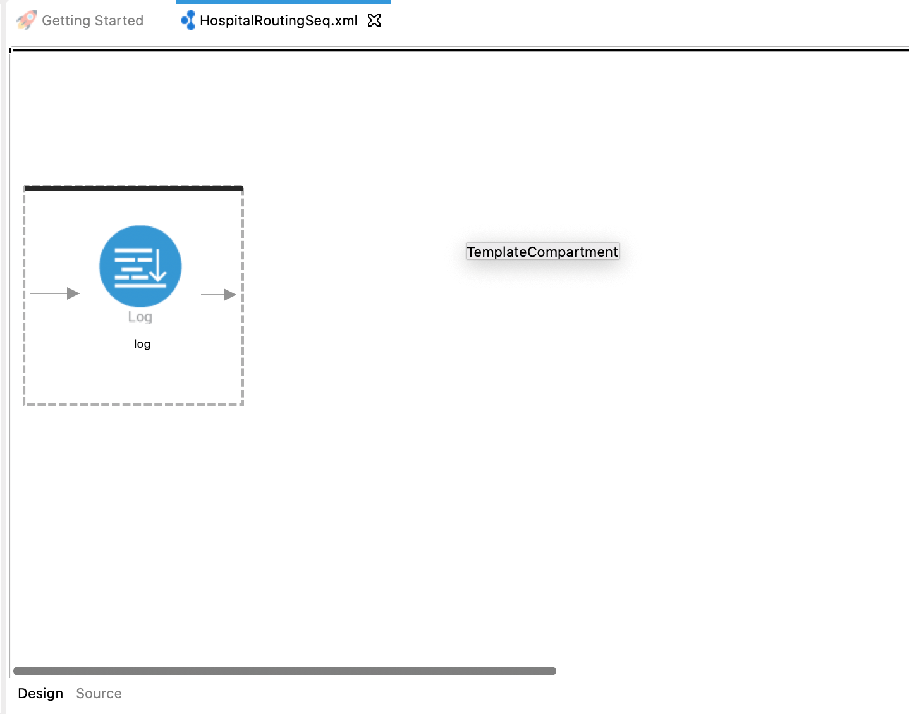

# Reusing Mediation Sequences

## What you'll build

In this sample scenario, you will use a **Sequence Template**
and reuse it in multiple places of the medation flow. You can reuse the
mediation flow that was defined in the [Sending a Simple Message to a Service](../sending-a-simple-message-to-a-service) tutorial and then replace its sections with the sequence template . See [Creating Templates](../../develop/creating-artifacts/creating-sequence-templates.md) for details
on how to work with templates using WSO2 Integration Studio.

## Let's get started!

### Step 1: Set up the workspace

To set up the tools:

-   Go to the [product page](https://wso2.com/integration/) of **WSO2 Micro Integrator**, download the product installer and run it to set up the product.
-   Download the relevant [WSO2 Integration Studio](https://wso2.com/integration/tooling/) based on your operating system. The path to the extracted/installed folder is referred to as `MI_TOOLING_HOME` throughout this tutorial.
-   Download the CLI Tool for monitoring artifact deployments.

To set up the previous artifacts:

1.  If you did not try the [Sending a Simple Message to a Service](../sending-a-simple-message-to-a-service) tutorial yet, open WSO2 Integration Studio, click **File**, and click **Import**. Next, expand the **WSO2** category and select **Existing WSO2 Projects into workspace**, click **Next** and upload the [pre-packaged
project](https://github.com/wso2-docs/WSO2_EI/blob/master/Integration-Tutorial-Artifacts/SimpleMessageToServiceTutorial.zip). 
2.  Download the JAR file of the back-end service from [here](https://github.com/wso2-docs/WSO2_EI/blob/master/Back-End-Service/Hospital-Service-2.0.0.jar).

### Step 2: Develop the integration artifacts

#### Create a Sequence Template

1.  Once you have exported the ESB project as described above, the project directory will appear with the artifacts as shown below.

    

2.  Right-click on **SampleServices** and navigate to **New -> Template** . The **New Template Artifact** dialog will open.
3.  Select the **Create a New Template** and click **Next**.
4.  Enter the following details and click **Finish**.
    <table>
        <tr>
            <th>Parameter</th>
            <th>Description</th>
        </tr>
        <tr>
            <td>Template Name</td>
            <td>HospitalRoutingSeq</td>
        </tr>
        <tr>
            <td>Template Type</td>
            <td>Sequence Template</td>
        </tr>
    </table>

    

5.  The template artifact will open in the canvas as shown below.

    

6.  Open the **Properties** tab of the sequence template by clicking on
    the canvas (outside the sequence box).  

7.  Click the  icon
    to start adding parameters .

     

8.  In the **Template Parameter** dialog that opens, enter 'sethospital' as the parameter name and click **Finish** .

9.  Add a **Log** mediator to the sequence template as shown below. This
    will print a message indicating to which hospital a requested
    message is routed.

     

10. Open the **Properties** tab of the log mediator and specify the
    following:

    <table>
        <tr>
            <th>Property</th>
            <th>Description</th>
        </tr>
        <tr>
            <td>Log Category</td>
            <td>INFO</td>
        </tr>
        <tr>
            <td>Log Level</td>
            <td>CUSTOM</td>
        </tr>
    </table>

11. Click the  icon
    to start defining a property. Then add the following details for the
    property:

    <table>
        <tr>
            <th>Property Name</th>
            <th>Description</th>
        </tr>
        <tr>
            <td> Name</td>
            <td>message</td>
        </tr>
        <tr>
            <td>Type</td>
            <td>EXPRESSION</td>
        </tr>
        <tr>
            <td>Property Expression</td>
            <td><code>fn:concat('Routing to ', get-property('Hospital')) </code></td>
        </tr>
    </table>

    We select EXPRESSION because the required properties for the log
    message must be extracted from the request, which we can do using an
    XPath expression.  

12. Add a **Property** mediator just after the **Log** mediator to store
    the value for uri.var.hospital.

     

13. With the **Property** mediator selected, access the **Properties**
    tab and enter the information given below:
    <table>
        <tr>
            <th>Property</th>
            <th>Description</th>
        </tr>
        <tr>
            <td>Property Name</td>
            <td>Select New Property</td>
        </tr>
        <tr>
            <td>New Property Name</td>
            <td>uri.var.hospital  </td>
        </tr>
        <tr>
            <td>URI Template</td>
            <td>Select set </td>
        </tr>
        <tr>
            <td>Value Type</td>
            <td>Select EXPRESSION</td>
        </tr>
        <tr>
            <td>Property Data Type</td>
            <td>Select STRING</td>
        </tr>
        <tr>
            <td>Value Expression</td>
            <td><code>$func:sethospital</code></td>
        </tr>
        <tr>
            <td>Description</td>
            <td>Set Hospital Variable</td>
        </tr>
    </table>

#### Update the mediation flow

1.  Open the design view of the HealthcareAPI.xml and delete 'GrandOak'
    **Log** mediator by right clicking the mediator and selecting
    **Delete from Model** .  
    

2.  Delete the 'Set Hospital Variable' **Property** mediator.

3.  Add a **Call Template** mediator to the sequence as shown below.  
    

4.  Open the **Properties** tab of the **Call Template** mediator and
    select ' HospitalRoutingSeq' from the list of available templates.

5.  Click the  icon
    to start adding parameters. Enter the following parameter details
    and click **Finish** .

    <table>
        <tr>
            <th>Parameter</th>
            <th>Description</th>
        </tr>
        <tr>
            <td>Parameter Name</td>
            <td>sethospital</td>
        </tr>
        <tr>
            <td>Parameter Type</td>
            <td>value</td>
        </tr>
        <tr>
            <td>Value/Expression</td>
            <td>grandoaks</td>
        </tr>
    </table>

    

6.  Repeat the above steps to add **Call Templates** for 'Clemency' and
    'Pine Valley' hospitals. Add **clemency** and **pinevalley** as the
    respective parameter values.

7.  Save the configuration.

### Step 3: Package the artifacts

Package the artifacts in your composite application project (SampleServicesCompositeApplication project) to be able to deploy the artifacts in the server.

1.  Open the `pom.xml` file in the composite application project POM editor.
2.  Ensure that the following artifacts are selected in the POM file.

    -   `HealthcareAPI`
    -   `HospitalRoutingSeq`

3.  Save the project.

### Step 4: Build and run the artifacts

To test the artifacts, deploy the [packaged artifacts](#step-3-package-the-artifacts) in the embedded Micro Integrator:

1.  Right-click the composite application project and click **Export Project Artifacts and Run**.
2.  In the dialog that opens, select the composite application project that you want to deploy.  
4.  Click **Finish**. The artifacts will be deployed in the embedded Micro Integrator and the server will start. See the startup log in the **Console** tab. 

### Step 5: Testing the use case

Let's use the **CLI Tool** to find the URL of the REST API that is deployed in the Micro Integrator:

1.  Open a terminal and navigate to the `CLI_HOME` directory.
2.  Execute the following command to start the tool:
    `./mi`
3.  Execute the following command to find the APIs deployed in the server:
    `mi show api`

Send a simple request to invoke the service.

1.  Open a command line terminal and execute the following command from
    the location where the request.json file you created is saved:

    ```
    curl -v -X POST --data @request.json http://localhost:8290/healthcare/categories/surgery/reserve --header "Content-Type:application/json"
    ```

2.  You will see the response in the command line terminal.
